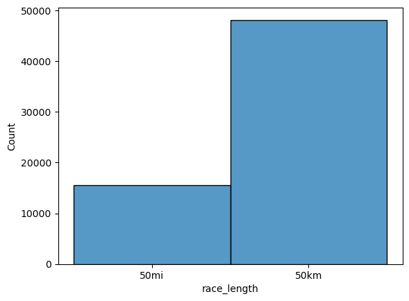
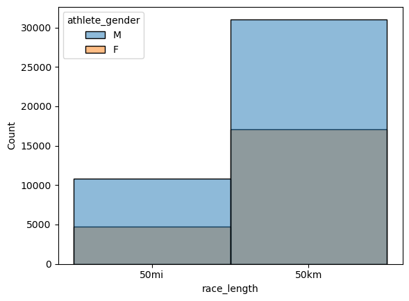
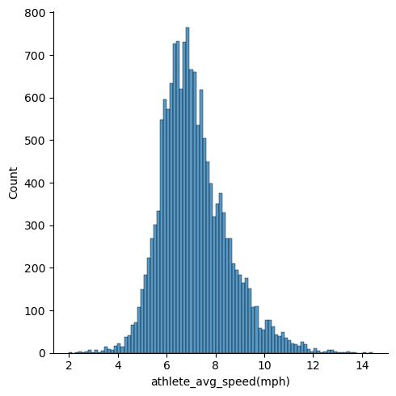
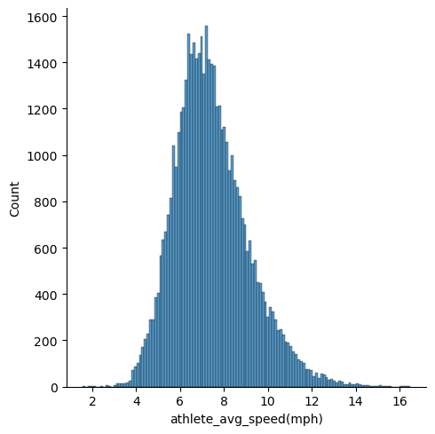
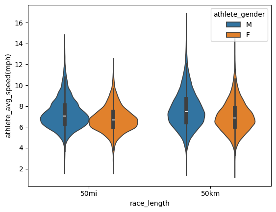
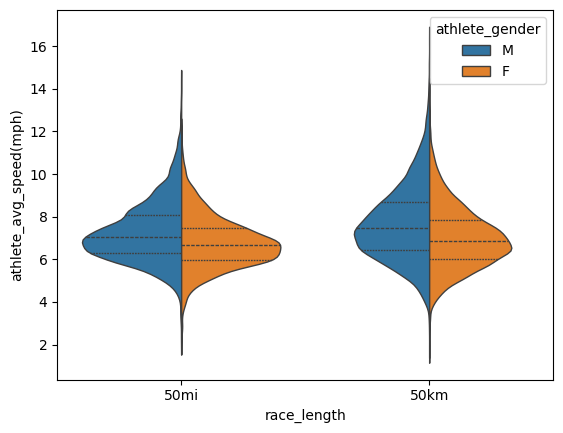
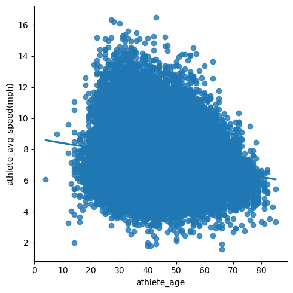
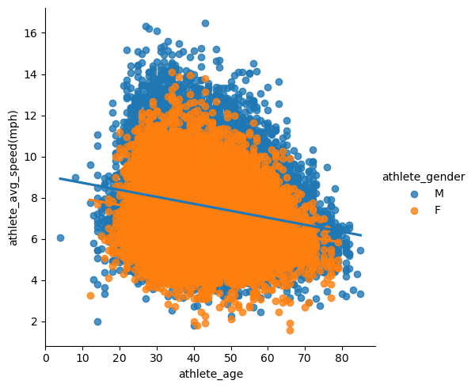

# This is a project using ultra marathon data to determine which seasons in the United States have the fastest and slowest race times for 50km vs 50mi races!

## Import our python packages


```python
import pandas as pd

```


```python
import seaborn as sns
```

### Begin the project by imorting the data and getting a glimpse of what the data looks like


```python
df = pd.read_csv('TWO_CENTURIES_OF_UM_RACES.csv')
```

    /var/folders/42/86k38n294gj14hbr0dwtbg180000gn/T/ipykernel_6621/107228863.py:1: DtypeWarning: Columns (11) have mixed types. Specify dtype option on import or set low_memory=False.
      df = pd.read_csv('TWO_CENTURIES_OF_UM_RACES.csv')


```python
df.head()
```


<div>
<style scoped>
    .dataframe tbody tr th:only-of-type {
        vertical-align: middle;
    }

    .dataframe tbody tr th {
        vertical-align: top;
    }

    .dataframe thead th {
        text-align: right;
    }
</style>
<table border="1" class="dataframe">
  <thead>
    <tr style="text-align: right;">
      <th></th>
      <th>Year of event</th>
      <th>Event dates</th>
      <th>Event name</th>
      <th>Event distance/length</th>
      <th>Event number of finishers</th>
      <th>Athlete performance</th>
      <th>Athlete club</th>
      <th>Athlete country</th>
      <th>Athlete year of birth</th>
      <th>Athlete gender</th>
      <th>Athlete age category</th>
      <th>Athlete average speed</th>
      <th>Athlete ID</th>
    </tr>
  </thead>
  <tbody>
    <tr>
      <th>0</th>
      <td>2018</td>
      <td>06.01.2018</td>
      <td>Selva Costera (CHI)</td>
      <td>50km</td>
      <td>22</td>
      <td>4:51:39 h</td>
      <td>Tnfrc</td>
      <td>CHI</td>
      <td>1978.0</td>
      <td>M</td>
      <td>M35</td>
      <td>10.286</td>
      <td>0</td>
    </tr>
    <tr>
      <th>1</th>
      <td>2018</td>
      <td>06.01.2018</td>
      <td>Selva Costera (CHI)</td>
      <td>50km</td>
      <td>22</td>
      <td>5:15:45 h</td>
      <td>Roberto Echeverría</td>
      <td>CHI</td>
      <td>1981.0</td>
      <td>M</td>
      <td>M35</td>
      <td>9.501</td>
      <td>1</td>
    </tr>
    <tr>
      <th>2</th>
      <td>2018</td>
      <td>06.01.2018</td>
      <td>Selva Costera (CHI)</td>
      <td>50km</td>
      <td>22</td>
      <td>5:16:44 h</td>
      <td>Puro Trail Osorno</td>
      <td>CHI</td>
      <td>1987.0</td>
      <td>M</td>
      <td>M23</td>
      <td>9.472</td>
      <td>2</td>
    </tr>
    <tr>
      <th>3</th>
      <td>2018</td>
      <td>06.01.2018</td>
      <td>Selva Costera (CHI)</td>
      <td>50km</td>
      <td>22</td>
      <td>5:34:13 h</td>
      <td>Columbia</td>
      <td>ARG</td>
      <td>1976.0</td>
      <td>M</td>
      <td>M40</td>
      <td>8.976</td>
      <td>3</td>
    </tr>
    <tr>
      <th>4</th>
      <td>2018</td>
      <td>06.01.2018</td>
      <td>Selva Costera (CHI)</td>
      <td>50km</td>
      <td>22</td>
      <td>5:54:14 h</td>
      <td>Baguales Trail</td>
      <td>CHI</td>
      <td>1992.0</td>
      <td>M</td>
      <td>M23</td>
      <td>8.469</td>
      <td>4</td>
    </tr>
  </tbody>
</table>
</div>


```python
df.tail()
```


<div>
<style scoped>
    .dataframe tbody tr th:only-of-type {
        vertical-align: middle;
    }

    .dataframe tbody tr th {
        vertical-align: top;
    }

    .dataframe thead th {
        text-align: right;
    }
</style>
<table border="1" class="dataframe">
  <thead>
    <tr style="text-align: right;">
      <th></th>
      <th>Year of event</th>
      <th>Event dates</th>
      <th>Event name</th>
      <th>Event distance/length</th>
      <th>Event number of finishers</th>
      <th>Athlete performance</th>
      <th>Athlete club</th>
      <th>Athlete country</th>
      <th>Athlete year of birth</th>
      <th>Athlete gender</th>
      <th>Athlete age category</th>
      <th>Athlete average speed</th>
      <th>Athlete ID</th>
    </tr>
  </thead>
  <tbody>
    <tr>
      <th>1048570</th>
      <td>2016</td>
      <td>08.10.2016</td>
      <td>Douro Trail (POR)</td>
      <td>45km</td>
      <td>146</td>
      <td>9:53:30 h</td>
      <td>Cães D'Avenida</td>
      <td>POR</td>
      <td>1981.0</td>
      <td>F</td>
      <td>W23</td>
      <td>4.549</td>
      <td>141496</td>
    </tr>
    <tr>
      <th>1048571</th>
      <td>2016</td>
      <td>08.10.2016</td>
      <td>Douro Trail (POR)</td>
      <td>45km</td>
      <td>146</td>
      <td>9:53:31 h</td>
      <td>Cães D'Avenida</td>
      <td>POR</td>
      <td>1972.0</td>
      <td>M</td>
      <td>M40</td>
      <td>4.549</td>
      <td>464239</td>
    </tr>
    <tr>
      <th>1048572</th>
      <td>2016</td>
      <td>08.10.2016</td>
      <td>Douro Trail (POR)</td>
      <td>45km</td>
      <td>146</td>
      <td>9:53:31 h</td>
      <td>Correr Leça</td>
      <td>POR</td>
      <td>1977.0</td>
      <td>M</td>
      <td>M35</td>
      <td>4.549</td>
      <td>88027</td>
    </tr>
    <tr>
      <th>1048573</th>
      <td>2016</td>
      <td>08.10.2016</td>
      <td>Douro Trail (POR)</td>
      <td>45km</td>
      <td>146</td>
      <td>9:55:09 h</td>
      <td>Jroxoaluminios</td>
      <td>POR</td>
      <td>NaN</td>
      <td>F</td>
      <td>NaN</td>
      <td>4.537</td>
      <td>500973</td>
    </tr>
    <tr>
      <th>1048574</th>
      <td>2016</td>
      <td>08.10.2016</td>
      <td>Douro Trail (POR)</td>
      <td>45km</td>
      <td>146</td>
      <td>10:02:23 h</td>
      <td>Jroxoaluminios</td>
      <td>POR</td>
      <td>1972.0</td>
      <td>M</td>
      <td>M40</td>
      <td>4.482</td>
      <td>45141</td>
    </tr>
  </tbody>
</table>
</div>


```python
df.info()
```

    <class 'pandas.core.frame.DataFrame'>
    RangeIndex: 1048575 entries, 0 to 1048574
    Data columns (total 13 columns):
     #   Column                     Non-Null Count    Dtype  
    ---  ------                     --------------    -----  
     0   Year of event              1048575 non-null  int64  
     1   Event dates                1048575 non-null  object 
     2   Event name                 1048575 non-null  object 
     3   Event distance/length      1048290 non-null  object 
     4   Event number of finishers  1048575 non-null  int64  
     5   Athlete performance        1048575 non-null  object 
     6   Athlete club               621596 non-null   object 
     7   Athlete country            1048575 non-null  object 
     8   Athlete year of birth      972449 non-null   float64
     9   Athlete gender             1048575 non-null  object 
     10  Athlete age category       972936 non-null   object 
     11  Athlete average speed      1048564 non-null  object 
     12  Athlete ID                 1048575 non-null  int64  
    dtypes: float64(1), int64(3), object(9)
    memory usage: 104.0+ MB


```python
df.shape
```


    (1048575, 13)


```python
df.dtypes
```


    Year of event                  int64
    Event dates                   object
    Event name                    object
    Event distance/length         object
    Event number of finishers      int64
    Athlete performance           object
    Athlete club                  object
    Athlete country               object
    Athlete year of birth        float64
    Athlete gender                object
    Athlete age category          object
    Athlete average speed         object
    Athlete ID                     int64
    dtype: object


```python
#get US races with 50k or 50mi
#filter for 50km or 50mi below
```

### Start to filter races to determine what U.S. based races look like


```python
df[df['Event distance/length'] == '50mi']
```


<div>
<style scoped>
    .dataframe tbody tr th:only-of-type {
        vertical-align: middle;
    }

    .dataframe tbody tr th {
        vertical-align: top;
    }

    .dataframe thead th {
        text-align: right;
    }
</style>
<table border="1" class="dataframe">
  <thead>
    <tr style="text-align: right;">
      <th></th>
      <th>Year of event</th>
      <th>Event dates</th>
      <th>Event name</th>
      <th>Event distance/length</th>
      <th>Event number of finishers</th>
      <th>Athlete performance</th>
      <th>Athlete club</th>
      <th>Athlete country</th>
      <th>Athlete year of birth</th>
      <th>Athlete gender</th>
      <th>Athlete age category</th>
      <th>Athlete average speed</th>
      <th>Athlete ID</th>
    </tr>
  </thead>
  <tbody>
    <tr>
      <th>55</th>
      <td>2018</td>
      <td>06.01.2018</td>
      <td>Yankee Springs 50 Mile Winter Challenge (USA)</td>
      <td>50mi</td>
      <td>9</td>
      <td>9:53:05 h</td>
      <td>*Middleville, MI</td>
      <td>USA</td>
      <td>1983.0</td>
      <td>M</td>
      <td>M23</td>
      <td>8.141</td>
      <td>55</td>
    </tr>
    <tr>
      <th>56</th>
      <td>2018</td>
      <td>06.01.2018</td>
      <td>Yankee Springs 50 Mile Winter Challenge (USA)</td>
      <td>50mi</td>
      <td>9</td>
      <td>11:09:35 h</td>
      <td>*Waterloo, ON</td>
      <td>CAN</td>
      <td>1977.0</td>
      <td>F</td>
      <td>W40</td>
      <td>7.211</td>
      <td>56</td>
    </tr>
    <tr>
      <th>57</th>
      <td>2018</td>
      <td>06.01.2018</td>
      <td>Yankee Springs 50 Mile Winter Challenge (USA)</td>
      <td>50mi</td>
      <td>9</td>
      <td>11:33:00 h</td>
      <td>*Kitchener, ON</td>
      <td>CAN</td>
      <td>1976.0</td>
      <td>M</td>
      <td>M40</td>
      <td>6.967</td>
      <td>57</td>
    </tr>
    <tr>
      <th>58</th>
      <td>2018</td>
      <td>06.01.2018</td>
      <td>Yankee Springs 50 Mile Winter Challenge (USA)</td>
      <td>50mi</td>
      <td>9</td>
      <td>11:38:17 h</td>
      <td>*Utica, MI</td>
      <td>USA</td>
      <td>1986.0</td>
      <td>M</td>
      <td>M23</td>
      <td>6.914</td>
      <td>58</td>
    </tr>
    <tr>
      <th>59</th>
      <td>2018</td>
      <td>06.01.2018</td>
      <td>Yankee Springs 50 Mile Winter Challenge (USA)</td>
      <td>50mi</td>
      <td>9</td>
      <td>11:56:35 h</td>
      <td>*Grass Lake, MI</td>
      <td>USA</td>
      <td>1988.0</td>
      <td>M</td>
      <td>M23</td>
      <td>6.738</td>
      <td>59</td>
    </tr>
    <tr>
      <th>...</th>
      <td>...</td>
      <td>...</td>
      <td>...</td>
      <td>...</td>
      <td>...</td>
      <td>...</td>
      <td>...</td>
      <td>...</td>
      <td>...</td>
      <td>...</td>
      <td>...</td>
      <td>...</td>
      <td>...</td>
    </tr>
    <tr>
      <th>1043693</th>
      <td>2016</td>
      <td>09.10.2016</td>
      <td>Farm to Farm 50 Mile Ultra Run (USA)</td>
      <td>50mi</td>
      <td>7</td>
      <td>8:32:12 h</td>
      <td>*Lunenburg, MA</td>
      <td>USA</td>
      <td>1973.0</td>
      <td>M</td>
      <td>M40</td>
      <td>9.426</td>
      <td>497773</td>
    </tr>
    <tr>
      <th>1043694</th>
      <td>2016</td>
      <td>09.10.2016</td>
      <td>Farm to Farm 50 Mile Ultra Run (USA)</td>
      <td>50mi</td>
      <td>7</td>
      <td>8:34:47 h</td>
      <td>*Freeport, ME</td>
      <td>USA</td>
      <td>1986.0</td>
      <td>M</td>
      <td>M23</td>
      <td>9.379</td>
      <td>213536</td>
    </tr>
    <tr>
      <th>1043695</th>
      <td>2016</td>
      <td>09.10.2016</td>
      <td>Farm to Farm 50 Mile Ultra Run (USA)</td>
      <td>50mi</td>
      <td>7</td>
      <td>8:40:12 h</td>
      <td>*Naples, ME</td>
      <td>USA</td>
      <td>1977.0</td>
      <td>M</td>
      <td>M35</td>
      <td>9.281</td>
      <td>182357</td>
    </tr>
    <tr>
      <th>1043696</th>
      <td>2016</td>
      <td>09.10.2016</td>
      <td>Farm to Farm 50 Mile Ultra Run (USA)</td>
      <td>50mi</td>
      <td>7</td>
      <td>9:20:13 h</td>
      <td>*Amesbury, MA</td>
      <td>USA</td>
      <td>1966.0</td>
      <td>M</td>
      <td>M45</td>
      <td>8.618</td>
      <td>488588</td>
    </tr>
    <tr>
      <th>1043697</th>
      <td>2016</td>
      <td>09.10.2016</td>
      <td>Farm to Farm 50 Mile Ultra Run (USA)</td>
      <td>50mi</td>
      <td>7</td>
      <td>9:47:17 h</td>
      <td>*Raynham, MA</td>
      <td>USA</td>
      <td>1983.0</td>
      <td>F</td>
      <td>W23</td>
      <td>8.221</td>
      <td>497774</td>
    </tr>
  </tbody>
</table>
<p>35788 rows × 13 columns</p>
</div>


### combine 50km and 50mi with 'isin' command


```python
df[df['Event distance/length'].isin(['50km', '50mi'])]
```


<div>
<style scoped>
    .dataframe tbody tr th:only-of-type {
        vertical-align: middle;
    }

    .dataframe tbody tr th {
        vertical-align: top;
    }

    .dataframe thead th {
        text-align: right;
    }
</style>
<table border="1" class="dataframe">
  <thead>
    <tr style="text-align: right;">
      <th></th>
      <th>Year of event</th>
      <th>Event dates</th>
      <th>Event name</th>
      <th>Event distance/length</th>
      <th>Event number of finishers</th>
      <th>Athlete performance</th>
      <th>Athlete club</th>
      <th>Athlete country</th>
      <th>Athlete year of birth</th>
      <th>Athlete gender</th>
      <th>Athlete age category</th>
      <th>Athlete average speed</th>
      <th>Athlete ID</th>
    </tr>
  </thead>
  <tbody>
    <tr>
      <th>0</th>
      <td>2018</td>
      <td>06.01.2018</td>
      <td>Selva Costera (CHI)</td>
      <td>50km</td>
      <td>22</td>
      <td>4:51:39 h</td>
      <td>Tnfrc</td>
      <td>CHI</td>
      <td>1978.0</td>
      <td>M</td>
      <td>M35</td>
      <td>10.286</td>
      <td>0</td>
    </tr>
    <tr>
      <th>1</th>
      <td>2018</td>
      <td>06.01.2018</td>
      <td>Selva Costera (CHI)</td>
      <td>50km</td>
      <td>22</td>
      <td>5:15:45 h</td>
      <td>Roberto Echeverría</td>
      <td>CHI</td>
      <td>1981.0</td>
      <td>M</td>
      <td>M35</td>
      <td>9.501</td>
      <td>1</td>
    </tr>
    <tr>
      <th>2</th>
      <td>2018</td>
      <td>06.01.2018</td>
      <td>Selva Costera (CHI)</td>
      <td>50km</td>
      <td>22</td>
      <td>5:16:44 h</td>
      <td>Puro Trail Osorno</td>
      <td>CHI</td>
      <td>1987.0</td>
      <td>M</td>
      <td>M23</td>
      <td>9.472</td>
      <td>2</td>
    </tr>
    <tr>
      <th>3</th>
      <td>2018</td>
      <td>06.01.2018</td>
      <td>Selva Costera (CHI)</td>
      <td>50km</td>
      <td>22</td>
      <td>5:34:13 h</td>
      <td>Columbia</td>
      <td>ARG</td>
      <td>1976.0</td>
      <td>M</td>
      <td>M40</td>
      <td>8.976</td>
      <td>3</td>
    </tr>
    <tr>
      <th>4</th>
      <td>2018</td>
      <td>06.01.2018</td>
      <td>Selva Costera (CHI)</td>
      <td>50km</td>
      <td>22</td>
      <td>5:54:14 h</td>
      <td>Baguales Trail</td>
      <td>CHI</td>
      <td>1992.0</td>
      <td>M</td>
      <td>M23</td>
      <td>8.469</td>
      <td>4</td>
    </tr>
    <tr>
      <th>...</th>
      <td>...</td>
      <td>...</td>
      <td>...</td>
      <td>...</td>
      <td>...</td>
      <td>...</td>
      <td>...</td>
      <td>...</td>
      <td>...</td>
      <td>...</td>
      <td>...</td>
      <td>...</td>
      <td>...</td>
    </tr>
    <tr>
      <th>1047611</th>
      <td>2016</td>
      <td>08.10.2016</td>
      <td>Skyline to the Sea 50km (USA)</td>
      <td>50km</td>
      <td>138</td>
      <td>8:25:58 h</td>
      <td>*Modesto, CA</td>
      <td>USA</td>
      <td>1959.0</td>
      <td>M</td>
      <td>M55</td>
      <td>5.929</td>
      <td>46397</td>
    </tr>
    <tr>
      <th>1047612</th>
      <td>2016</td>
      <td>08.10.2016</td>
      <td>Skyline to the Sea 50km (USA)</td>
      <td>50km</td>
      <td>138</td>
      <td>8:26:33 h</td>
      <td>*Modesto, CA</td>
      <td>USA</td>
      <td>1970.0</td>
      <td>F</td>
      <td>W45</td>
      <td>5.922</td>
      <td>500658</td>
    </tr>
    <tr>
      <th>1047613</th>
      <td>2016</td>
      <td>08.10.2016</td>
      <td>Skyline to the Sea 50km (USA)</td>
      <td>50km</td>
      <td>138</td>
      <td>8:41:12 h</td>
      <td>*Cupertino, CA</td>
      <td>USA</td>
      <td>1976.0</td>
      <td>F</td>
      <td>W35</td>
      <td>5.756</td>
      <td>500659</td>
    </tr>
    <tr>
      <th>1047614</th>
      <td>2016</td>
      <td>08.10.2016</td>
      <td>Skyline to the Sea 50km (USA)</td>
      <td>50km</td>
      <td>138</td>
      <td>9:18:27 h</td>
      <td>*Long Beach, CA</td>
      <td>USA</td>
      <td>1959.0</td>
      <td>F</td>
      <td>W55</td>
      <td>5.372</td>
      <td>500660</td>
    </tr>
    <tr>
      <th>1047615</th>
      <td>2016</td>
      <td>08.10.2016</td>
      <td>Skyline to the Sea 50km (USA)</td>
      <td>50km</td>
      <td>138</td>
      <td>9:20:52 h</td>
      <td>*Torrance, CA</td>
      <td>USA</td>
      <td>1929.0</td>
      <td>M</td>
      <td>M85</td>
      <td>5.349</td>
      <td>434804</td>
    </tr>
  </tbody>
</table>
<p>269089 rows × 13 columns</p>
</div>


```python
df[(df['Event distance/length'].isin(['50km', '50mi'])) & (df['Year of event'] == 2018)]
```


<div>
<style scoped>
    .dataframe tbody tr th:only-of-type {
        vertical-align: middle;
    }

    .dataframe tbody tr th {
        vertical-align: top;
    }

    .dataframe thead th {
        text-align: right;
    }
</style>
<table border="1" class="dataframe">
  <thead>
    <tr style="text-align: right;">
      <th></th>
      <th>Year of event</th>
      <th>Event dates</th>
      <th>Event name</th>
      <th>Event distance/length</th>
      <th>Event number of finishers</th>
      <th>Athlete performance</th>
      <th>Athlete club</th>
      <th>Athlete country</th>
      <th>Athlete year of birth</th>
      <th>Athlete gender</th>
      <th>Athlete age category</th>
      <th>Athlete average speed</th>
      <th>Athlete ID</th>
    </tr>
  </thead>
  <tbody>
    <tr>
      <th>0</th>
      <td>2018</td>
      <td>06.01.2018</td>
      <td>Selva Costera (CHI)</td>
      <td>50km</td>
      <td>22</td>
      <td>4:51:39 h</td>
      <td>Tnfrc</td>
      <td>CHI</td>
      <td>1978.0</td>
      <td>M</td>
      <td>M35</td>
      <td>10.286</td>
      <td>0</td>
    </tr>
    <tr>
      <th>1</th>
      <td>2018</td>
      <td>06.01.2018</td>
      <td>Selva Costera (CHI)</td>
      <td>50km</td>
      <td>22</td>
      <td>5:15:45 h</td>
      <td>Roberto Echeverría</td>
      <td>CHI</td>
      <td>1981.0</td>
      <td>M</td>
      <td>M35</td>
      <td>9.501</td>
      <td>1</td>
    </tr>
    <tr>
      <th>2</th>
      <td>2018</td>
      <td>06.01.2018</td>
      <td>Selva Costera (CHI)</td>
      <td>50km</td>
      <td>22</td>
      <td>5:16:44 h</td>
      <td>Puro Trail Osorno</td>
      <td>CHI</td>
      <td>1987.0</td>
      <td>M</td>
      <td>M23</td>
      <td>9.472</td>
      <td>2</td>
    </tr>
    <tr>
      <th>3</th>
      <td>2018</td>
      <td>06.01.2018</td>
      <td>Selva Costera (CHI)</td>
      <td>50km</td>
      <td>22</td>
      <td>5:34:13 h</td>
      <td>Columbia</td>
      <td>ARG</td>
      <td>1976.0</td>
      <td>M</td>
      <td>M40</td>
      <td>8.976</td>
      <td>3</td>
    </tr>
    <tr>
      <th>4</th>
      <td>2018</td>
      <td>06.01.2018</td>
      <td>Selva Costera (CHI)</td>
      <td>50km</td>
      <td>22</td>
      <td>5:54:14 h</td>
      <td>Baguales Trail</td>
      <td>CHI</td>
      <td>1992.0</td>
      <td>M</td>
      <td>M23</td>
      <td>8.469</td>
      <td>4</td>
    </tr>
    <tr>
      <th>...</th>
      <td>...</td>
      <td>...</td>
      <td>...</td>
      <td>...</td>
      <td>...</td>
      <td>...</td>
      <td>...</td>
      <td>...</td>
      <td>...</td>
      <td>...</td>
      <td>...</td>
      <td>...</td>
      <td>...</td>
    </tr>
    <tr>
      <th>661478</th>
      <td>2018</td>
      <td>27.-28.10.2018</td>
      <td>Cactus Rose 50 Mile (USA)</td>
      <td>50mi</td>
      <td>29</td>
      <td>17:05:58 h</td>
      <td>NaN</td>
      <td>USA</td>
      <td>1972.0</td>
      <td>M</td>
      <td>M45</td>
      <td>4.706</td>
      <td>68122</td>
    </tr>
    <tr>
      <th>661479</th>
      <td>2018</td>
      <td>27.-28.10.2018</td>
      <td>Cactus Rose 50 Mile (USA)</td>
      <td>50mi</td>
      <td>29</td>
      <td>18:13:01 h</td>
      <td>NaN</td>
      <td>USA</td>
      <td>1953.0</td>
      <td>M</td>
      <td>M65</td>
      <td>4.417</td>
      <td>23336</td>
    </tr>
    <tr>
      <th>661480</th>
      <td>2018</td>
      <td>27.-28.10.2018</td>
      <td>Cactus Rose 50 Mile (USA)</td>
      <td>50mi</td>
      <td>29</td>
      <td>18:49:58 h</td>
      <td>NaN</td>
      <td>USA</td>
      <td>1986.0</td>
      <td>M</td>
      <td>M23</td>
      <td>4.273</td>
      <td>375022</td>
    </tr>
    <tr>
      <th>661481</th>
      <td>2018</td>
      <td>27.-28.10.2018</td>
      <td>Cactus Rose 50 Mile (USA)</td>
      <td>50mi</td>
      <td>29</td>
      <td>23:30:00 h</td>
      <td>NaN</td>
      <td>USA</td>
      <td>1952.0</td>
      <td>M</td>
      <td>M65</td>
      <td>3.424</td>
      <td>68273</td>
    </tr>
    <tr>
      <th>661482</th>
      <td>2018</td>
      <td>27.-28.10.2018</td>
      <td>Cactus Rose 50 Mile (USA)</td>
      <td>50mi</td>
      <td>29</td>
      <td>25:40:10 h</td>
      <td>NaN</td>
      <td>USA</td>
      <td>1951.0</td>
      <td>M</td>
      <td>M65</td>
      <td>3.135</td>
      <td>341648</td>
    </tr>
  </tbody>
</table>
<p>167243 rows × 13 columns</p>
</div>


```python
df[df['Event name'] == 'Everglades 50 Mile Ultra Run (USA)']
### now we just want USA in our location names
```


<div>
<style scoped>
    .dataframe tbody tr th:only-of-type {
        vertical-align: middle;
    }

    .dataframe tbody tr th {
        vertical-align: top;
    }

    .dataframe thead th {
        text-align: right;
    }
</style>
<table border="1" class="dataframe">
  <thead>
    <tr style="text-align: right;">
      <th></th>
      <th>Year of event</th>
      <th>Event dates</th>
      <th>Event name</th>
      <th>Event distance/length</th>
      <th>Event number of finishers</th>
      <th>Athlete performance</th>
      <th>Athlete club</th>
      <th>Athlete country</th>
      <th>Athlete year of birth</th>
      <th>Athlete gender</th>
      <th>Athlete age category</th>
      <th>Athlete average speed</th>
      <th>Athlete ID</th>
    </tr>
  </thead>
  <tbody>
    <tr>
      <th>51923</th>
      <td>2018</td>
      <td>17.02.2018</td>
      <td>Everglades 50 Mile Ultra Run (USA)</td>
      <td>50mi</td>
      <td>23</td>
      <td>7:00:00 h</td>
      <td>*Tadworth</td>
      <td>GBR</td>
      <td>1980.0</td>
      <td>M</td>
      <td>M35</td>
      <td>11.495</td>
      <td>47601</td>
    </tr>
    <tr>
      <th>51924</th>
      <td>2018</td>
      <td>17.02.2018</td>
      <td>Everglades 50 Mile Ultra Run (USA)</td>
      <td>50mi</td>
      <td>23</td>
      <td>8:29:48 h</td>
      <td>*Fort Lauderdale, FL</td>
      <td>USA</td>
      <td>1989.0</td>
      <td>M</td>
      <td>M23</td>
      <td>9.47</td>
      <td>37220</td>
    </tr>
    <tr>
      <th>51925</th>
      <td>2018</td>
      <td>17.02.2018</td>
      <td>Everglades 50 Mile Ultra Run (USA)</td>
      <td>50mi</td>
      <td>23</td>
      <td>8:45:31 h</td>
      <td>*Miami, FL</td>
      <td>USA</td>
      <td>1979.0</td>
      <td>M</td>
      <td>M35</td>
      <td>9.187</td>
      <td>47602</td>
    </tr>
    <tr>
      <th>51926</th>
      <td>2018</td>
      <td>17.02.2018</td>
      <td>Everglades 50 Mile Ultra Run (USA)</td>
      <td>50mi</td>
      <td>23</td>
      <td>9:01:52 h</td>
      <td>*Fort Lauderdale, FL</td>
      <td>USA</td>
      <td>1967.0</td>
      <td>M</td>
      <td>M50</td>
      <td>8.91</td>
      <td>47603</td>
    </tr>
    <tr>
      <th>51927</th>
      <td>2018</td>
      <td>17.02.2018</td>
      <td>Everglades 50 Mile Ultra Run (USA)</td>
      <td>50mi</td>
      <td>23</td>
      <td>9:26:06 h</td>
      <td>*Naples, FL</td>
      <td>USA</td>
      <td>1986.0</td>
      <td>M</td>
      <td>M23</td>
      <td>8.529</td>
      <td>47604</td>
    </tr>
    <tr>
      <th>...</th>
      <td>...</td>
      <td>...</td>
      <td>...</td>
      <td>...</td>
      <td>...</td>
      <td>...</td>
      <td>...</td>
      <td>...</td>
      <td>...</td>
      <td>...</td>
      <td>...</td>
      <td>...</td>
      <td>...</td>
    </tr>
    <tr>
      <th>692653</th>
      <td>2016</td>
      <td>20.02.2016</td>
      <td>Everglades 50 Mile Ultra Run (USA)</td>
      <td>50mi</td>
      <td>44</td>
      <td>13:38:35 h</td>
      <td>*Boca Raton, FL</td>
      <td>USA</td>
      <td>1965.0</td>
      <td>F</td>
      <td>W50</td>
      <td>5.898</td>
      <td>387729</td>
    </tr>
    <tr>
      <th>692654</th>
      <td>2016</td>
      <td>20.02.2016</td>
      <td>Everglades 50 Mile Ultra Run (USA)</td>
      <td>50mi</td>
      <td>44</td>
      <td>13:48:50 h</td>
      <td>*Big Pine Key, FL</td>
      <td>USA</td>
      <td>1971.0</td>
      <td>F</td>
      <td>W40</td>
      <td>5.825</td>
      <td>12540</td>
    </tr>
    <tr>
      <th>692655</th>
      <td>2016</td>
      <td>20.02.2016</td>
      <td>Everglades 50 Mile Ultra Run (USA)</td>
      <td>50mi</td>
      <td>44</td>
      <td>13:48:51 h</td>
      <td>*Sugarloaf, FL</td>
      <td>USA</td>
      <td>1968.0</td>
      <td>F</td>
      <td>W45</td>
      <td>5.825</td>
      <td>12541</td>
    </tr>
    <tr>
      <th>692656</th>
      <td>2016</td>
      <td>20.02.2016</td>
      <td>Everglades 50 Mile Ultra Run (USA)</td>
      <td>50mi</td>
      <td>44</td>
      <td>14:10:58 h</td>
      <td>NaN</td>
      <td>USA</td>
      <td>1965.0</td>
      <td>M</td>
      <td>M50</td>
      <td>5.674</td>
      <td>387730</td>
    </tr>
    <tr>
      <th>692657</th>
      <td>2016</td>
      <td>20.02.2016</td>
      <td>Everglades 50 Mile Ultra Run (USA)</td>
      <td>50mi</td>
      <td>44</td>
      <td>14:10:59 h</td>
      <td>*Miami, FL</td>
      <td>USA</td>
      <td>1959.0</td>
      <td>F</td>
      <td>W55</td>
      <td>5.673</td>
      <td>26117</td>
    </tr>
  </tbody>
</table>
<p>67 rows × 13 columns</p>
</div>


### now we just want USA in our location names


```python


df[df['Event name'] == 'Everglades 50 Mile Ultra Run (USA)']['Event name'].str.split('(')
```


    51923     [Everglades 50 Mile Ultra Run , USA)]
    51924     [Everglades 50 Mile Ultra Run , USA)]
    51925     [Everglades 50 Mile Ultra Run , USA)]
    51926     [Everglades 50 Mile Ultra Run , USA)]
    51927     [Everglades 50 Mile Ultra Run , USA)]
                              ...                  
    692653    [Everglades 50 Mile Ultra Run , USA)]
    692654    [Everglades 50 Mile Ultra Run , USA)]
    692655    [Everglades 50 Mile Ultra Run , USA)]
    692656    [Everglades 50 Mile Ultra Run , USA)]
    692657    [Everglades 50 Mile Ultra Run , USA)]
    Name: Event name, Length: 67, dtype: object


### then we can make it only say 'USA' as the country like this...


```python
df[df['Event name'] == 'Everglades 50 Mile Ultra Run (USA)']['Event name'].str.split('(').str.get(1)
```


    51923     USA)
    51924     USA)
    51925     USA)
    51926     USA)
    51927     USA)
              ... 
    692653    USA)
    692654    USA)
    692655    USA)
    692656    USA)
    692657    USA)
    Name: Event name, Length: 67, dtype: object


```python
df[df['Event name'] == 'Everglades 50 Mile Ultra Run (USA)']['Event name'].str.split('(').str.get(1).str.split(')').str.get(0)
```


    51923     USA
    51924     USA
    51925     USA
    51926     USA
    51927     USA
             ... 
    692653    USA
    692654    USA
    692655    USA
    692656    USA
    692657    USA
    Name: Event name, Length: 67, dtype: object


```python
df[df['Event name'].str.split('(').str.get(1).str.split(')').str.get(0) == 'USA']
```


<div>
<style scoped>
    .dataframe tbody tr th:only-of-type {
        vertical-align: middle;
    }

    .dataframe tbody tr th {
        vertical-align: top;
    }

    .dataframe thead th {
        text-align: right;
    }
</style>
<table border="1" class="dataframe">
  <thead>
    <tr style="text-align: right;">
      <th></th>
      <th>Year of event</th>
      <th>Event dates</th>
      <th>Event name</th>
      <th>Event distance/length</th>
      <th>Event number of finishers</th>
      <th>Athlete performance</th>
      <th>Athlete club</th>
      <th>Athlete country</th>
      <th>Athlete year of birth</th>
      <th>Athlete gender</th>
      <th>Athlete age category</th>
      <th>Athlete average speed</th>
      <th>Athlete ID</th>
    </tr>
  </thead>
  <tbody>
    <tr>
      <th>55</th>
      <td>2018</td>
      <td>06.01.2018</td>
      <td>Yankee Springs 50 Mile Winter Challenge (USA)</td>
      <td>50mi</td>
      <td>9</td>
      <td>9:53:05 h</td>
      <td>*Middleville, MI</td>
      <td>USA</td>
      <td>1983.0</td>
      <td>M</td>
      <td>M23</td>
      <td>8.141</td>
      <td>55</td>
    </tr>
    <tr>
      <th>56</th>
      <td>2018</td>
      <td>06.01.2018</td>
      <td>Yankee Springs 50 Mile Winter Challenge (USA)</td>
      <td>50mi</td>
      <td>9</td>
      <td>11:09:35 h</td>
      <td>*Waterloo, ON</td>
      <td>CAN</td>
      <td>1977.0</td>
      <td>F</td>
      <td>W40</td>
      <td>7.211</td>
      <td>56</td>
    </tr>
    <tr>
      <th>57</th>
      <td>2018</td>
      <td>06.01.2018</td>
      <td>Yankee Springs 50 Mile Winter Challenge (USA)</td>
      <td>50mi</td>
      <td>9</td>
      <td>11:33:00 h</td>
      <td>*Kitchener, ON</td>
      <td>CAN</td>
      <td>1976.0</td>
      <td>M</td>
      <td>M40</td>
      <td>6.967</td>
      <td>57</td>
    </tr>
    <tr>
      <th>58</th>
      <td>2018</td>
      <td>06.01.2018</td>
      <td>Yankee Springs 50 Mile Winter Challenge (USA)</td>
      <td>50mi</td>
      <td>9</td>
      <td>11:38:17 h</td>
      <td>*Utica, MI</td>
      <td>USA</td>
      <td>1986.0</td>
      <td>M</td>
      <td>M23</td>
      <td>6.914</td>
      <td>58</td>
    </tr>
    <tr>
      <th>59</th>
      <td>2018</td>
      <td>06.01.2018</td>
      <td>Yankee Springs 50 Mile Winter Challenge (USA)</td>
      <td>50mi</td>
      <td>9</td>
      <td>11:56:35 h</td>
      <td>*Grass Lake, MI</td>
      <td>USA</td>
      <td>1988.0</td>
      <td>M</td>
      <td>M23</td>
      <td>6.738</td>
      <td>59</td>
    </tr>
    <tr>
      <th>...</th>
      <td>...</td>
      <td>...</td>
      <td>...</td>
      <td>...</td>
      <td>...</td>
      <td>...</td>
      <td>...</td>
      <td>...</td>
      <td>...</td>
      <td>...</td>
      <td>...</td>
      <td>...</td>
      <td>...</td>
    </tr>
    <tr>
      <th>1047611</th>
      <td>2016</td>
      <td>08.10.2016</td>
      <td>Skyline to the Sea 50km (USA)</td>
      <td>50km</td>
      <td>138</td>
      <td>8:25:58 h</td>
      <td>*Modesto, CA</td>
      <td>USA</td>
      <td>1959.0</td>
      <td>M</td>
      <td>M55</td>
      <td>5.929</td>
      <td>46397</td>
    </tr>
    <tr>
      <th>1047612</th>
      <td>2016</td>
      <td>08.10.2016</td>
      <td>Skyline to the Sea 50km (USA)</td>
      <td>50km</td>
      <td>138</td>
      <td>8:26:33 h</td>
      <td>*Modesto, CA</td>
      <td>USA</td>
      <td>1970.0</td>
      <td>F</td>
      <td>W45</td>
      <td>5.922</td>
      <td>500658</td>
    </tr>
    <tr>
      <th>1047613</th>
      <td>2016</td>
      <td>08.10.2016</td>
      <td>Skyline to the Sea 50km (USA)</td>
      <td>50km</td>
      <td>138</td>
      <td>8:41:12 h</td>
      <td>*Cupertino, CA</td>
      <td>USA</td>
      <td>1976.0</td>
      <td>F</td>
      <td>W35</td>
      <td>5.756</td>
      <td>500659</td>
    </tr>
    <tr>
      <th>1047614</th>
      <td>2016</td>
      <td>08.10.2016</td>
      <td>Skyline to the Sea 50km (USA)</td>
      <td>50km</td>
      <td>138</td>
      <td>9:18:27 h</td>
      <td>*Long Beach, CA</td>
      <td>USA</td>
      <td>1959.0</td>
      <td>F</td>
      <td>W55</td>
      <td>5.372</td>
      <td>500660</td>
    </tr>
    <tr>
      <th>1047615</th>
      <td>2016</td>
      <td>08.10.2016</td>
      <td>Skyline to the Sea 50km (USA)</td>
      <td>50km</td>
      <td>138</td>
      <td>9:20:52 h</td>
      <td>*Torrance, CA</td>
      <td>USA</td>
      <td>1929.0</td>
      <td>M</td>
      <td>M85</td>
      <td>5.349</td>
      <td>434804</td>
    </tr>
  </tbody>
</table>
<p>162047 rows × 13 columns</p>
</div>


### combine all the filters together now


```python
df[(df['Event distance/length'].isin(['50km', '50mi'])) & (df['Year of event'] == 2018) & (df['Event name'].str.split('(').str.get(1).str.split(')').str.get(0) == 'USA')]

```


<div>
<style scoped>
    .dataframe tbody tr th:only-of-type {
        vertical-align: middle;
    }

    .dataframe tbody tr th {
        vertical-align: top;
    }

    .dataframe thead th {
        text-align: right;
    }
</style>
<table border="1" class="dataframe">
  <thead>
    <tr style="text-align: right;">
      <th></th>
      <th>Year of event</th>
      <th>Event dates</th>
      <th>Event name</th>
      <th>Event distance/length</th>
      <th>Event number of finishers</th>
      <th>Athlete performance</th>
      <th>Athlete club</th>
      <th>Athlete country</th>
      <th>Athlete year of birth</th>
      <th>Athlete gender</th>
      <th>Athlete age category</th>
      <th>Athlete average speed</th>
      <th>Athlete ID</th>
    </tr>
  </thead>
  <tbody>
    <tr>
      <th>55</th>
      <td>2018</td>
      <td>06.01.2018</td>
      <td>Yankee Springs 50 Mile Winter Challenge (USA)</td>
      <td>50mi</td>
      <td>9</td>
      <td>9:53:05 h</td>
      <td>*Middleville, MI</td>
      <td>USA</td>
      <td>1983.0</td>
      <td>M</td>
      <td>M23</td>
      <td>8.141</td>
      <td>55</td>
    </tr>
    <tr>
      <th>56</th>
      <td>2018</td>
      <td>06.01.2018</td>
      <td>Yankee Springs 50 Mile Winter Challenge (USA)</td>
      <td>50mi</td>
      <td>9</td>
      <td>11:09:35 h</td>
      <td>*Waterloo, ON</td>
      <td>CAN</td>
      <td>1977.0</td>
      <td>F</td>
      <td>W40</td>
      <td>7.211</td>
      <td>56</td>
    </tr>
    <tr>
      <th>57</th>
      <td>2018</td>
      <td>06.01.2018</td>
      <td>Yankee Springs 50 Mile Winter Challenge (USA)</td>
      <td>50mi</td>
      <td>9</td>
      <td>11:33:00 h</td>
      <td>*Kitchener, ON</td>
      <td>CAN</td>
      <td>1976.0</td>
      <td>M</td>
      <td>M40</td>
      <td>6.967</td>
      <td>57</td>
    </tr>
    <tr>
      <th>58</th>
      <td>2018</td>
      <td>06.01.2018</td>
      <td>Yankee Springs 50 Mile Winter Challenge (USA)</td>
      <td>50mi</td>
      <td>9</td>
      <td>11:38:17 h</td>
      <td>*Utica, MI</td>
      <td>USA</td>
      <td>1986.0</td>
      <td>M</td>
      <td>M23</td>
      <td>6.914</td>
      <td>58</td>
    </tr>
    <tr>
      <th>59</th>
      <td>2018</td>
      <td>06.01.2018</td>
      <td>Yankee Springs 50 Mile Winter Challenge (USA)</td>
      <td>50mi</td>
      <td>9</td>
      <td>11:56:35 h</td>
      <td>*Grass Lake, MI</td>
      <td>USA</td>
      <td>1988.0</td>
      <td>M</td>
      <td>M23</td>
      <td>6.738</td>
      <td>59</td>
    </tr>
    <tr>
      <th>...</th>
      <td>...</td>
      <td>...</td>
      <td>...</td>
      <td>...</td>
      <td>...</td>
      <td>...</td>
      <td>...</td>
      <td>...</td>
      <td>...</td>
      <td>...</td>
      <td>...</td>
      <td>...</td>
      <td>...</td>
    </tr>
    <tr>
      <th>661478</th>
      <td>2018</td>
      <td>27.-28.10.2018</td>
      <td>Cactus Rose 50 Mile (USA)</td>
      <td>50mi</td>
      <td>29</td>
      <td>17:05:58 h</td>
      <td>NaN</td>
      <td>USA</td>
      <td>1972.0</td>
      <td>M</td>
      <td>M45</td>
      <td>4.706</td>
      <td>68122</td>
    </tr>
    <tr>
      <th>661479</th>
      <td>2018</td>
      <td>27.-28.10.2018</td>
      <td>Cactus Rose 50 Mile (USA)</td>
      <td>50mi</td>
      <td>29</td>
      <td>18:13:01 h</td>
      <td>NaN</td>
      <td>USA</td>
      <td>1953.0</td>
      <td>M</td>
      <td>M65</td>
      <td>4.417</td>
      <td>23336</td>
    </tr>
    <tr>
      <th>661480</th>
      <td>2018</td>
      <td>27.-28.10.2018</td>
      <td>Cactus Rose 50 Mile (USA)</td>
      <td>50mi</td>
      <td>29</td>
      <td>18:49:58 h</td>
      <td>NaN</td>
      <td>USA</td>
      <td>1986.0</td>
      <td>M</td>
      <td>M23</td>
      <td>4.273</td>
      <td>375022</td>
    </tr>
    <tr>
      <th>661481</th>
      <td>2018</td>
      <td>27.-28.10.2018</td>
      <td>Cactus Rose 50 Mile (USA)</td>
      <td>50mi</td>
      <td>29</td>
      <td>23:30:00 h</td>
      <td>NaN</td>
      <td>USA</td>
      <td>1952.0</td>
      <td>M</td>
      <td>M65</td>
      <td>3.424</td>
      <td>68273</td>
    </tr>
    <tr>
      <th>661482</th>
      <td>2018</td>
      <td>27.-28.10.2018</td>
      <td>Cactus Rose 50 Mile (USA)</td>
      <td>50mi</td>
      <td>29</td>
      <td>25:40:10 h</td>
      <td>NaN</td>
      <td>USA</td>
      <td>1951.0</td>
      <td>M</td>
      <td>M65</td>
      <td>3.135</td>
      <td>341648</td>
    </tr>
  </tbody>
</table>
<p>64299 rows × 13 columns</p>
</div>


```python
df2 = df[(df['Event distance/length'].isin(['50km', '50mi'])) & (df['Year of event'] == 2018) & (df['Event name'].str.split('(').str.get(1).str.split(')').str.get(0) == 'USA')]

```


```python
df2.head()
```


<div>
<style scoped>
    .dataframe tbody tr th:only-of-type {
        vertical-align: middle;
    }

    .dataframe tbody tr th {
        vertical-align: top;
    }

    .dataframe thead th {
        text-align: right;
    }
</style>
<table border="1" class="dataframe">
  <thead>
    <tr style="text-align: right;">
      <th></th>
      <th>Year of event</th>
      <th>Event dates</th>
      <th>Event name</th>
      <th>Event distance/length</th>
      <th>Event number of finishers</th>
      <th>Athlete performance</th>
      <th>Athlete club</th>
      <th>Athlete country</th>
      <th>Athlete year of birth</th>
      <th>Athlete gender</th>
      <th>Athlete age category</th>
      <th>Athlete average speed</th>
      <th>Athlete ID</th>
    </tr>
  </thead>
  <tbody>
    <tr>
      <th>55</th>
      <td>2018</td>
      <td>06.01.2018</td>
      <td>Yankee Springs 50 Mile Winter Challenge (USA)</td>
      <td>50mi</td>
      <td>9</td>
      <td>9:53:05 h</td>
      <td>*Middleville, MI</td>
      <td>USA</td>
      <td>1983.0</td>
      <td>M</td>
      <td>M23</td>
      <td>8.141</td>
      <td>55</td>
    </tr>
    <tr>
      <th>56</th>
      <td>2018</td>
      <td>06.01.2018</td>
      <td>Yankee Springs 50 Mile Winter Challenge (USA)</td>
      <td>50mi</td>
      <td>9</td>
      <td>11:09:35 h</td>
      <td>*Waterloo, ON</td>
      <td>CAN</td>
      <td>1977.0</td>
      <td>F</td>
      <td>W40</td>
      <td>7.211</td>
      <td>56</td>
    </tr>
    <tr>
      <th>57</th>
      <td>2018</td>
      <td>06.01.2018</td>
      <td>Yankee Springs 50 Mile Winter Challenge (USA)</td>
      <td>50mi</td>
      <td>9</td>
      <td>11:33:00 h</td>
      <td>*Kitchener, ON</td>
      <td>CAN</td>
      <td>1976.0</td>
      <td>M</td>
      <td>M40</td>
      <td>6.967</td>
      <td>57</td>
    </tr>
    <tr>
      <th>58</th>
      <td>2018</td>
      <td>06.01.2018</td>
      <td>Yankee Springs 50 Mile Winter Challenge (USA)</td>
      <td>50mi</td>
      <td>9</td>
      <td>11:38:17 h</td>
      <td>*Utica, MI</td>
      <td>USA</td>
      <td>1986.0</td>
      <td>M</td>
      <td>M23</td>
      <td>6.914</td>
      <td>58</td>
    </tr>
    <tr>
      <th>59</th>
      <td>2018</td>
      <td>06.01.2018</td>
      <td>Yankee Springs 50 Mile Winter Challenge (USA)</td>
      <td>50mi</td>
      <td>9</td>
      <td>11:56:35 h</td>
      <td>*Grass Lake, MI</td>
      <td>USA</td>
      <td>1988.0</td>
      <td>M</td>
      <td>M23</td>
      <td>6.738</td>
      <td>59</td>
    </tr>
  </tbody>
</table>
</div>


### Checking our data types 


```python
df2.info()
```

    <class 'pandas.core.frame.DataFrame'>
    Index: 64299 entries, 55 to 661482
    Data columns (total 13 columns):
     #   Column                     Non-Null Count  Dtype  
    ---  ------                     --------------  -----  
     0   Year of event              64299 non-null  int64  
     1   Event dates                64299 non-null  object 
     2   Event name                 64299 non-null  object 
     3   Event distance/length      64299 non-null  object 
     4   Event number of finishers  64299 non-null  int64  
     5   Athlete performance        64299 non-null  object 
     6   Athlete club               54329 non-null  object 
     7   Athlete country            64299 non-null  object 
     8   Athlete year of birth      63724 non-null  float64
     9   Athlete gender             64299 non-null  object 
     10  Athlete age category       63759 non-null  object 
     11  Athlete average speed      64299 non-null  object 
     12  Athlete ID                 64299 non-null  int64  
    dtypes: float64(1), int64(3), object(9)
    memory usage: 6.9+ MB


```python
df2.shape
```


    (64299, 13)


### tidy up event names


```python
df2['Event name'].str.split('(').str.get(0)
```


    55        Yankee Springs 50 Mile Winter Challenge 
    56        Yankee Springs 50 Mile Winter Challenge 
    57        Yankee Springs 50 Mile Winter Challenge 
    58        Yankee Springs 50 Mile Winter Challenge 
    59        Yankee Springs 50 Mile Winter Challenge 
                                ...                   
    661478                        Cactus Rose 50 Mile 
    661479                        Cactus Rose 50 Mile 
    661480                        Cactus Rose 50 Mile 
    661481                        Cactus Rose 50 Mile 
    661482                        Cactus Rose 50 Mile 
    Name: Event name, Length: 64299, dtype: object


```python
df2['Event name'] = df2['Event name'].str.split('(').str.get(0)
```

    /var/folders/42/86k38n294gj14hbr0dwtbg180000gn/T/ipykernel_6621/3473829760.py:1: SettingWithCopyWarning: 
    A value is trying to be set on a copy of a slice from a DataFrame.
    Try using .loc[row_indexer,col_indexer] = value instead
    
    See the caveats in the documentation: https://pandas.pydata.org/pandas-docs/stable/user_guide/indexing.html#returning-a-view-versus-a-copy
      df2['Event name'] = df2['Event name'].str.split('(').str.get(0)


```python
df2.head()
```


<div>
<style scoped>
    .dataframe tbody tr th:only-of-type {
        vertical-align: middle;
    }

    .dataframe tbody tr th {
        vertical-align: top;
    }

    .dataframe thead th {
        text-align: right;
    }
</style>
<table border="1" class="dataframe">
  <thead>
    <tr style="text-align: right;">
      <th></th>
      <th>Year of event</th>
      <th>Event dates</th>
      <th>Event name</th>
      <th>Event distance/length</th>
      <th>Event number of finishers</th>
      <th>Athlete performance</th>
      <th>Athlete club</th>
      <th>Athlete country</th>
      <th>Athlete year of birth</th>
      <th>Athlete gender</th>
      <th>Athlete age category</th>
      <th>Athlete average speed</th>
      <th>Athlete ID</th>
    </tr>
  </thead>
  <tbody>
    <tr>
      <th>55</th>
      <td>2018</td>
      <td>06.01.2018</td>
      <td>Yankee Springs 50 Mile Winter Challenge</td>
      <td>50mi</td>
      <td>9</td>
      <td>9:53:05 h</td>
      <td>*Middleville, MI</td>
      <td>USA</td>
      <td>1983.0</td>
      <td>M</td>
      <td>M23</td>
      <td>8.141</td>
      <td>55</td>
    </tr>
    <tr>
      <th>56</th>
      <td>2018</td>
      <td>06.01.2018</td>
      <td>Yankee Springs 50 Mile Winter Challenge</td>
      <td>50mi</td>
      <td>9</td>
      <td>11:09:35 h</td>
      <td>*Waterloo, ON</td>
      <td>CAN</td>
      <td>1977.0</td>
      <td>F</td>
      <td>W40</td>
      <td>7.211</td>
      <td>56</td>
    </tr>
    <tr>
      <th>57</th>
      <td>2018</td>
      <td>06.01.2018</td>
      <td>Yankee Springs 50 Mile Winter Challenge</td>
      <td>50mi</td>
      <td>9</td>
      <td>11:33:00 h</td>
      <td>*Kitchener, ON</td>
      <td>CAN</td>
      <td>1976.0</td>
      <td>M</td>
      <td>M40</td>
      <td>6.967</td>
      <td>57</td>
    </tr>
    <tr>
      <th>58</th>
      <td>2018</td>
      <td>06.01.2018</td>
      <td>Yankee Springs 50 Mile Winter Challenge</td>
      <td>50mi</td>
      <td>9</td>
      <td>11:38:17 h</td>
      <td>*Utica, MI</td>
      <td>USA</td>
      <td>1986.0</td>
      <td>M</td>
      <td>M23</td>
      <td>6.914</td>
      <td>58</td>
    </tr>
    <tr>
      <th>59</th>
      <td>2018</td>
      <td>06.01.2018</td>
      <td>Yankee Springs 50 Mile Winter Challenge</td>
      <td>50mi</td>
      <td>9</td>
      <td>11:56:35 h</td>
      <td>*Grass Lake, MI</td>
      <td>USA</td>
      <td>1988.0</td>
      <td>M</td>
      <td>M23</td>
      <td>6.738</td>
      <td>59</td>
    </tr>
  </tbody>
</table>
</div>


### tidy up athlete age from 'M23' to seperate value


```python
df2['athlete_age'] = 2020 - df2['Athlete year of birth']
```

    /var/folders/42/86k38n294gj14hbr0dwtbg180000gn/T/ipykernel_6621/3897931444.py:1: SettingWithCopyWarning: 
    A value is trying to be set on a copy of a slice from a DataFrame.
    Try using .loc[row_indexer,col_indexer] = value instead
    
    See the caveats in the documentation: https://pandas.pydata.org/pandas-docs/stable/user_guide/indexing.html#returning-a-view-versus-a-copy
      df2['athlete_age'] = 2020 - df2['Athlete year of birth']


```python
df2.head()
```


<div>
<style scoped>
    .dataframe tbody tr th:only-of-type {
        vertical-align: middle;
    }

    .dataframe tbody tr th {
        vertical-align: top;
    }

    .dataframe thead th {
        text-align: right;
    }
</style>
<table border="1" class="dataframe">
  <thead>
    <tr style="text-align: right;">
      <th></th>
      <th>Year of event</th>
      <th>Event dates</th>
      <th>Event name</th>
      <th>Event distance/length</th>
      <th>Event number of finishers</th>
      <th>Athlete performance</th>
      <th>Athlete club</th>
      <th>Athlete country</th>
      <th>Athlete year of birth</th>
      <th>Athlete gender</th>
      <th>Athlete age category</th>
      <th>Athlete average speed</th>
      <th>Athlete ID</th>
      <th>athlete_age</th>
    </tr>
  </thead>
  <tbody>
    <tr>
      <th>55</th>
      <td>2018</td>
      <td>06.01.2018</td>
      <td>Yankee Springs 50 Mile Winter Challenge</td>
      <td>50mi</td>
      <td>9</td>
      <td>9:53:05 h</td>
      <td>*Middleville, MI</td>
      <td>USA</td>
      <td>1983.0</td>
      <td>M</td>
      <td>M23</td>
      <td>8.141</td>
      <td>55</td>
      <td>37.0</td>
    </tr>
    <tr>
      <th>56</th>
      <td>2018</td>
      <td>06.01.2018</td>
      <td>Yankee Springs 50 Mile Winter Challenge</td>
      <td>50mi</td>
      <td>9</td>
      <td>11:09:35 h</td>
      <td>*Waterloo, ON</td>
      <td>CAN</td>
      <td>1977.0</td>
      <td>F</td>
      <td>W40</td>
      <td>7.211</td>
      <td>56</td>
      <td>43.0</td>
    </tr>
    <tr>
      <th>57</th>
      <td>2018</td>
      <td>06.01.2018</td>
      <td>Yankee Springs 50 Mile Winter Challenge</td>
      <td>50mi</td>
      <td>9</td>
      <td>11:33:00 h</td>
      <td>*Kitchener, ON</td>
      <td>CAN</td>
      <td>1976.0</td>
      <td>M</td>
      <td>M40</td>
      <td>6.967</td>
      <td>57</td>
      <td>44.0</td>
    </tr>
    <tr>
      <th>58</th>
      <td>2018</td>
      <td>06.01.2018</td>
      <td>Yankee Springs 50 Mile Winter Challenge</td>
      <td>50mi</td>
      <td>9</td>
      <td>11:38:17 h</td>
      <td>*Utica, MI</td>
      <td>USA</td>
      <td>1986.0</td>
      <td>M</td>
      <td>M23</td>
      <td>6.914</td>
      <td>58</td>
      <td>34.0</td>
    </tr>
    <tr>
      <th>59</th>
      <td>2018</td>
      <td>06.01.2018</td>
      <td>Yankee Springs 50 Mile Winter Challenge</td>
      <td>50mi</td>
      <td>9</td>
      <td>11:56:35 h</td>
      <td>*Grass Lake, MI</td>
      <td>USA</td>
      <td>1988.0</td>
      <td>M</td>
      <td>M23</td>
      <td>6.738</td>
      <td>59</td>
      <td>32.0</td>
    </tr>
  </tbody>
</table>
</div>


### removing the 'h' from athlete performance 


```python
df2['Athlete performance'] = df2['Athlete performance'].str.split('h').str.get(0)
```

    /var/folders/42/86k38n294gj14hbr0dwtbg180000gn/T/ipykernel_6621/2439908443.py:1: SettingWithCopyWarning: 
    A value is trying to be set on a copy of a slice from a DataFrame.
    Try using .loc[row_indexer,col_indexer] = value instead
    
    See the caveats in the documentation: https://pandas.pydata.org/pandas-docs/stable/user_guide/indexing.html#returning-a-view-versus-a-copy
      df2['Athlete performance'] = df2['Athlete performance'].str.split('h').str.get(0)


```python
df2.head()
```


<div>
<style scoped>
    .dataframe tbody tr th:only-of-type {
        vertical-align: middle;
    }

    .dataframe tbody tr th {
        vertical-align: top;
    }

    .dataframe thead th {
        text-align: right;
    }
</style>
<table border="1" class="dataframe">
  <thead>
    <tr style="text-align: right;">
      <th></th>
      <th>Year of event</th>
      <th>Event dates</th>
      <th>Event name</th>
      <th>Event distance/length</th>
      <th>Event number of finishers</th>
      <th>Athlete performance</th>
      <th>Athlete club</th>
      <th>Athlete country</th>
      <th>Athlete year of birth</th>
      <th>Athlete gender</th>
      <th>Athlete age category</th>
      <th>Athlete average speed</th>
      <th>Athlete ID</th>
      <th>athlete_age</th>
    </tr>
  </thead>
  <tbody>
    <tr>
      <th>55</th>
      <td>2018</td>
      <td>06.01.2018</td>
      <td>Yankee Springs 50 Mile Winter Challenge</td>
      <td>50mi</td>
      <td>9</td>
      <td>9:53:05</td>
      <td>*Middleville, MI</td>
      <td>USA</td>
      <td>1983.0</td>
      <td>M</td>
      <td>M23</td>
      <td>8.141</td>
      <td>55</td>
      <td>37.0</td>
    </tr>
    <tr>
      <th>56</th>
      <td>2018</td>
      <td>06.01.2018</td>
      <td>Yankee Springs 50 Mile Winter Challenge</td>
      <td>50mi</td>
      <td>9</td>
      <td>11:09:35</td>
      <td>*Waterloo, ON</td>
      <td>CAN</td>
      <td>1977.0</td>
      <td>F</td>
      <td>W40</td>
      <td>7.211</td>
      <td>56</td>
      <td>43.0</td>
    </tr>
    <tr>
      <th>57</th>
      <td>2018</td>
      <td>06.01.2018</td>
      <td>Yankee Springs 50 Mile Winter Challenge</td>
      <td>50mi</td>
      <td>9</td>
      <td>11:33:00</td>
      <td>*Kitchener, ON</td>
      <td>CAN</td>
      <td>1976.0</td>
      <td>M</td>
      <td>M40</td>
      <td>6.967</td>
      <td>57</td>
      <td>44.0</td>
    </tr>
    <tr>
      <th>58</th>
      <td>2018</td>
      <td>06.01.2018</td>
      <td>Yankee Springs 50 Mile Winter Challenge</td>
      <td>50mi</td>
      <td>9</td>
      <td>11:38:17</td>
      <td>*Utica, MI</td>
      <td>USA</td>
      <td>1986.0</td>
      <td>M</td>
      <td>M23</td>
      <td>6.914</td>
      <td>58</td>
      <td>34.0</td>
    </tr>
    <tr>
      <th>59</th>
      <td>2018</td>
      <td>06.01.2018</td>
      <td>Yankee Springs 50 Mile Winter Challenge</td>
      <td>50mi</td>
      <td>9</td>
      <td>11:56:35</td>
      <td>*Grass Lake, MI</td>
      <td>USA</td>
      <td>1988.0</td>
      <td>M</td>
      <td>M23</td>
      <td>6.738</td>
      <td>59</td>
      <td>32.0</td>
    </tr>
  </tbody>
</table>
</div>


### lets drop a few columns we no longer need now: Athlete country, Athlete club, Athlete year of birth, 


```python
df2 = df2.drop(['Athlete club', 'Athlete country', 'Athlete year of birth'], axis = 1)
```


```python
df2.head()
```


<div>
<style scoped>
    .dataframe tbody tr th:only-of-type {
        vertical-align: middle;
    }

    .dataframe tbody tr th {
        vertical-align: top;
    }

    .dataframe thead th {
        text-align: right;
    }
</style>
<table border="1" class="dataframe">
  <thead>
    <tr style="text-align: right;">
      <th></th>
      <th>Year of event</th>
      <th>Event dates</th>
      <th>Event name</th>
      <th>Event distance/length</th>
      <th>Event number of finishers</th>
      <th>Athlete performance</th>
      <th>Athlete gender</th>
      <th>Athlete age category</th>
      <th>Athlete average speed</th>
      <th>Athlete ID</th>
      <th>athlete_age</th>
    </tr>
  </thead>
  <tbody>
    <tr>
      <th>55</th>
      <td>2018</td>
      <td>06.01.2018</td>
      <td>Yankee Springs 50 Mile Winter Challenge</td>
      <td>50mi</td>
      <td>9</td>
      <td>9:53:05</td>
      <td>M</td>
      <td>M23</td>
      <td>8.141</td>
      <td>55</td>
      <td>37.0</td>
    </tr>
    <tr>
      <th>56</th>
      <td>2018</td>
      <td>06.01.2018</td>
      <td>Yankee Springs 50 Mile Winter Challenge</td>
      <td>50mi</td>
      <td>9</td>
      <td>11:09:35</td>
      <td>F</td>
      <td>W40</td>
      <td>7.211</td>
      <td>56</td>
      <td>43.0</td>
    </tr>
    <tr>
      <th>57</th>
      <td>2018</td>
      <td>06.01.2018</td>
      <td>Yankee Springs 50 Mile Winter Challenge</td>
      <td>50mi</td>
      <td>9</td>
      <td>11:33:00</td>
      <td>M</td>
      <td>M40</td>
      <td>6.967</td>
      <td>57</td>
      <td>44.0</td>
    </tr>
    <tr>
      <th>58</th>
      <td>2018</td>
      <td>06.01.2018</td>
      <td>Yankee Springs 50 Mile Winter Challenge</td>
      <td>50mi</td>
      <td>9</td>
      <td>11:38:17</td>
      <td>M</td>
      <td>M23</td>
      <td>6.914</td>
      <td>58</td>
      <td>34.0</td>
    </tr>
    <tr>
      <th>59</th>
      <td>2018</td>
      <td>06.01.2018</td>
      <td>Yankee Springs 50 Mile Winter Challenge</td>
      <td>50mi</td>
      <td>9</td>
      <td>11:56:35</td>
      <td>M</td>
      <td>M23</td>
      <td>6.738</td>
      <td>59</td>
      <td>32.0</td>
    </tr>
  </tbody>
</table>
</div>


```python
df2.tail()
```


<div>
<style scoped>
    .dataframe tbody tr th:only-of-type {
        vertical-align: middle;
    }

    .dataframe tbody tr th {
        vertical-align: top;
    }

    .dataframe thead th {
        text-align: right;
    }
</style>
<table border="1" class="dataframe">
  <thead>
    <tr style="text-align: right;">
      <th></th>
      <th>Year of event</th>
      <th>Event dates</th>
      <th>Event name</th>
      <th>Event distance/length</th>
      <th>Event number of finishers</th>
      <th>Athlete performance</th>
      <th>Athlete gender</th>
      <th>Athlete age category</th>
      <th>Athlete average speed</th>
      <th>Athlete ID</th>
      <th>athlete_age</th>
    </tr>
  </thead>
  <tbody>
    <tr>
      <th>661478</th>
      <td>2018</td>
      <td>27.-28.10.2018</td>
      <td>Cactus Rose 50 Mile</td>
      <td>50mi</td>
      <td>29</td>
      <td>17:05:58</td>
      <td>M</td>
      <td>M45</td>
      <td>4.706</td>
      <td>68122</td>
      <td>48.0</td>
    </tr>
    <tr>
      <th>661479</th>
      <td>2018</td>
      <td>27.-28.10.2018</td>
      <td>Cactus Rose 50 Mile</td>
      <td>50mi</td>
      <td>29</td>
      <td>18:13:01</td>
      <td>M</td>
      <td>M65</td>
      <td>4.417</td>
      <td>23336</td>
      <td>67.0</td>
    </tr>
    <tr>
      <th>661480</th>
      <td>2018</td>
      <td>27.-28.10.2018</td>
      <td>Cactus Rose 50 Mile</td>
      <td>50mi</td>
      <td>29</td>
      <td>18:49:58</td>
      <td>M</td>
      <td>M23</td>
      <td>4.273</td>
      <td>375022</td>
      <td>34.0</td>
    </tr>
    <tr>
      <th>661481</th>
      <td>2018</td>
      <td>27.-28.10.2018</td>
      <td>Cactus Rose 50 Mile</td>
      <td>50mi</td>
      <td>29</td>
      <td>23:30:00</td>
      <td>M</td>
      <td>M65</td>
      <td>3.424</td>
      <td>68273</td>
      <td>68.0</td>
    </tr>
    <tr>
      <th>661482</th>
      <td>2018</td>
      <td>27.-28.10.2018</td>
      <td>Cactus Rose 50 Mile</td>
      <td>50mi</td>
      <td>29</td>
      <td>25:40:10</td>
      <td>M</td>
      <td>M65</td>
      <td>3.135</td>
      <td>341648</td>
      <td>69.0</td>
    </tr>
  </tbody>
</table>
</div>


### clean up null values now


```python
df.isna().sum()
```


    Year of event                     0
    Event dates                       0
    Event name                        0
    Event distance/length           285
    Event number of finishers         0
    Athlete performance               0
    Athlete club                 426979
    Athlete country                   0
    Athlete year of birth         76126
    Athlete gender                    0
    Athlete age category          75639
    Athlete average speed            11
    Athlete ID                        0
    dtype: int64


```python
df2[df2['athlete_age'].isna() == 1]
```


<div>
<style scoped>
    .dataframe tbody tr th:only-of-type {
        vertical-align: middle;
    }

    .dataframe tbody tr th {
        vertical-align: top;
    }

    .dataframe thead th {
        text-align: right;
    }
</style>
<table border="1" class="dataframe">
  <thead>
    <tr style="text-align: right;">
      <th></th>
      <th>Year of event</th>
      <th>Event dates</th>
      <th>Event name</th>
      <th>Event distance/length</th>
      <th>Event number of finishers</th>
      <th>Athlete performance</th>
      <th>Athlete gender</th>
      <th>Athlete age category</th>
      <th>Athlete average speed</th>
      <th>Athlete ID</th>
      <th>athlete_age</th>
    </tr>
  </thead>
  <tbody>
    <tr>
      <th>453</th>
      <td>2018</td>
      <td>01.01.2018</td>
      <td>Red Eye 50km</td>
      <td>50km</td>
      <td>21</td>
      <td>5:10:00</td>
      <td>M</td>
      <td>NaN</td>
      <td>9.677</td>
      <td>453</td>
      <td>NaN</td>
    </tr>
    <tr>
      <th>456</th>
      <td>2018</td>
      <td>01.01.2018</td>
      <td>Red Eye 50km</td>
      <td>50km</td>
      <td>21</td>
      <td>5:44:00</td>
      <td>M</td>
      <td>NaN</td>
      <td>8.721</td>
      <td>456</td>
      <td>NaN</td>
    </tr>
    <tr>
      <th>459</th>
      <td>2018</td>
      <td>01.01.2018</td>
      <td>Red Eye 50km</td>
      <td>50km</td>
      <td>21</td>
      <td>6:07:00</td>
      <td>M</td>
      <td>NaN</td>
      <td>8.174</td>
      <td>459</td>
      <td>NaN</td>
    </tr>
    <tr>
      <th>460</th>
      <td>2018</td>
      <td>01.01.2018</td>
      <td>Red Eye 50km</td>
      <td>50km</td>
      <td>21</td>
      <td>6:12:00</td>
      <td>M</td>
      <td>NaN</td>
      <td>8.065</td>
      <td>460</td>
      <td>NaN</td>
    </tr>
    <tr>
      <th>13214</th>
      <td>2018</td>
      <td>17.03.2018</td>
      <td>Lt. JC Stone 50K UltraMarathon</td>
      <td>50km</td>
      <td>34</td>
      <td>4:54:43</td>
      <td>F</td>
      <td>NaN</td>
      <td>10.179</td>
      <td>12483</td>
      <td>NaN</td>
    </tr>
    <tr>
      <th>...</th>
      <td>...</td>
      <td>...</td>
      <td>...</td>
      <td>...</td>
      <td>...</td>
      <td>...</td>
      <td>...</td>
      <td>...</td>
      <td>...</td>
      <td>...</td>
      <td>...</td>
    </tr>
    <tr>
      <th>659684</th>
      <td>2018</td>
      <td>27.10.2018</td>
      <td>Lake Hodges Trail Fest 50K</td>
      <td>50km</td>
      <td>133</td>
      <td>8:24:14</td>
      <td>F</td>
      <td>NaN</td>
      <td>5.95</td>
      <td>374269</td>
      <td>NaN</td>
    </tr>
    <tr>
      <th>659685</th>
      <td>2018</td>
      <td>27.10.2018</td>
      <td>Lake Hodges Trail Fest 50K</td>
      <td>50km</td>
      <td>133</td>
      <td>8:25:12</td>
      <td>F</td>
      <td>NaN</td>
      <td>5.938</td>
      <td>358717</td>
      <td>NaN</td>
    </tr>
    <tr>
      <th>659688</th>
      <td>2018</td>
      <td>27.10.2018</td>
      <td>Lake Hodges Trail Fest 50K</td>
      <td>50km</td>
      <td>133</td>
      <td>8:29:59</td>
      <td>M</td>
      <td>NaN</td>
      <td>5.883</td>
      <td>204804</td>
      <td>NaN</td>
    </tr>
    <tr>
      <th>659689</th>
      <td>2018</td>
      <td>27.10.2018</td>
      <td>Lake Hodges Trail Fest 50K</td>
      <td>50km</td>
      <td>133</td>
      <td>8:31:30</td>
      <td>F</td>
      <td>NaN</td>
      <td>5.865</td>
      <td>374272</td>
      <td>NaN</td>
    </tr>
    <tr>
      <th>659690</th>
      <td>2018</td>
      <td>27.10.2018</td>
      <td>Lake Hodges Trail Fest 50K</td>
      <td>50km</td>
      <td>133</td>
      <td>8:35:28</td>
      <td>M</td>
      <td>NaN</td>
      <td>5.82</td>
      <td>374273</td>
      <td>NaN</td>
    </tr>
  </tbody>
</table>
<p>575 rows × 11 columns</p>
</div>


```python
df2 = df2.dropna()
```


```python
df2.shape
```


    (63720, 11)


### checking for duplicates


```python
df2[df2.duplicated() == True] 
```


<div>
<style scoped>
    .dataframe tbody tr th:only-of-type {
        vertical-align: middle;
    }

    .dataframe tbody tr th {
        vertical-align: top;
    }

    .dataframe thead th {
        text-align: right;
    }
</style>
<table border="1" class="dataframe">
  <thead>
    <tr style="text-align: right;">
      <th></th>
      <th>Year of event</th>
      <th>Event dates</th>
      <th>Event name</th>
      <th>Event distance/length</th>
      <th>Event number of finishers</th>
      <th>Athlete performance</th>
      <th>Athlete gender</th>
      <th>Athlete age category</th>
      <th>Athlete average speed</th>
      <th>Athlete ID</th>
      <th>athlete_age</th>
    </tr>
  </thead>
  <tbody>
  </tbody>
</table>
</div>


### nothing here

### now resetting the index


```python
df2.reset_index(drop = True)
```


<div>
<style scoped>
    .dataframe tbody tr th:only-of-type {
        vertical-align: middle;
    }

    .dataframe tbody tr th {
        vertical-align: top;
    }

    .dataframe thead th {
        text-align: right;
    }
</style>
<table border="1" class="dataframe">
  <thead>
    <tr style="text-align: right;">
      <th></th>
      <th>Year of event</th>
      <th>Event dates</th>
      <th>Event name</th>
      <th>Event distance/length</th>
      <th>Event number of finishers</th>
      <th>Athlete performance</th>
      <th>Athlete gender</th>
      <th>Athlete age category</th>
      <th>Athlete average speed</th>
      <th>Athlete ID</th>
      <th>athlete_age</th>
    </tr>
  </thead>
  <tbody>
    <tr>
      <th>0</th>
      <td>2018</td>
      <td>06.01.2018</td>
      <td>Yankee Springs 50 Mile Winter Challenge</td>
      <td>50mi</td>
      <td>9</td>
      <td>9:53:05</td>
      <td>M</td>
      <td>M23</td>
      <td>8.141</td>
      <td>55</td>
      <td>37.0</td>
    </tr>
    <tr>
      <th>1</th>
      <td>2018</td>
      <td>06.01.2018</td>
      <td>Yankee Springs 50 Mile Winter Challenge</td>
      <td>50mi</td>
      <td>9</td>
      <td>11:09:35</td>
      <td>F</td>
      <td>W40</td>
      <td>7.211</td>
      <td>56</td>
      <td>43.0</td>
    </tr>
    <tr>
      <th>2</th>
      <td>2018</td>
      <td>06.01.2018</td>
      <td>Yankee Springs 50 Mile Winter Challenge</td>
      <td>50mi</td>
      <td>9</td>
      <td>11:33:00</td>
      <td>M</td>
      <td>M40</td>
      <td>6.967</td>
      <td>57</td>
      <td>44.0</td>
    </tr>
    <tr>
      <th>3</th>
      <td>2018</td>
      <td>06.01.2018</td>
      <td>Yankee Springs 50 Mile Winter Challenge</td>
      <td>50mi</td>
      <td>9</td>
      <td>11:38:17</td>
      <td>M</td>
      <td>M23</td>
      <td>6.914</td>
      <td>58</td>
      <td>34.0</td>
    </tr>
    <tr>
      <th>4</th>
      <td>2018</td>
      <td>06.01.2018</td>
      <td>Yankee Springs 50 Mile Winter Challenge</td>
      <td>50mi</td>
      <td>9</td>
      <td>11:56:35</td>
      <td>M</td>
      <td>M23</td>
      <td>6.738</td>
      <td>59</td>
      <td>32.0</td>
    </tr>
    <tr>
      <th>...</th>
      <td>...</td>
      <td>...</td>
      <td>...</td>
      <td>...</td>
      <td>...</td>
      <td>...</td>
      <td>...</td>
      <td>...</td>
      <td>...</td>
      <td>...</td>
      <td>...</td>
    </tr>
    <tr>
      <th>63715</th>
      <td>2018</td>
      <td>27.-28.10.2018</td>
      <td>Cactus Rose 50 Mile</td>
      <td>50mi</td>
      <td>29</td>
      <td>17:05:58</td>
      <td>M</td>
      <td>M45</td>
      <td>4.706</td>
      <td>68122</td>
      <td>48.0</td>
    </tr>
    <tr>
      <th>63716</th>
      <td>2018</td>
      <td>27.-28.10.2018</td>
      <td>Cactus Rose 50 Mile</td>
      <td>50mi</td>
      <td>29</td>
      <td>18:13:01</td>
      <td>M</td>
      <td>M65</td>
      <td>4.417</td>
      <td>23336</td>
      <td>67.0</td>
    </tr>
    <tr>
      <th>63717</th>
      <td>2018</td>
      <td>27.-28.10.2018</td>
      <td>Cactus Rose 50 Mile</td>
      <td>50mi</td>
      <td>29</td>
      <td>18:49:58</td>
      <td>M</td>
      <td>M23</td>
      <td>4.273</td>
      <td>375022</td>
      <td>34.0</td>
    </tr>
    <tr>
      <th>63718</th>
      <td>2018</td>
      <td>27.-28.10.2018</td>
      <td>Cactus Rose 50 Mile</td>
      <td>50mi</td>
      <td>29</td>
      <td>23:30:00</td>
      <td>M</td>
      <td>M65</td>
      <td>3.424</td>
      <td>68273</td>
      <td>68.0</td>
    </tr>
    <tr>
      <th>63719</th>
      <td>2018</td>
      <td>27.-28.10.2018</td>
      <td>Cactus Rose 50 Mile</td>
      <td>50mi</td>
      <td>29</td>
      <td>25:40:10</td>
      <td>M</td>
      <td>M65</td>
      <td>3.135</td>
      <td>341648</td>
      <td>69.0</td>
    </tr>
  </tbody>
</table>
<p>63720 rows × 11 columns</p>
</div>


### Fixing data types 


```python
df2.dtypes
```


    Year of event                  int64
    Event dates                   object
    Event name                    object
    Event distance/length         object
    Event number of finishers      int64
    Athlete performance           object
    Athlete gender                object
    Athlete age category          object
    Athlete average speed         object
    Athlete ID                     int64
    athlete_age                  float64
    dtype: object


```python
df2['athlete_age'] = df2['athlete_age'].astype(int)
```


```python
df2['Athlete average speed'] = df2['Athlete average speed'].astype(float)
```


```python
df2.head()
```


<div>
<style scoped>
    .dataframe tbody tr th:only-of-type {
        vertical-align: middle;
    }

    .dataframe tbody tr th {
        vertical-align: top;
    }

    .dataframe thead th {
        text-align: right;
    }
</style>
<table border="1" class="dataframe">
  <thead>
    <tr style="text-align: right;">
      <th></th>
      <th>Year of event</th>
      <th>Event dates</th>
      <th>Event name</th>
      <th>Event distance/length</th>
      <th>Event number of finishers</th>
      <th>Athlete performance</th>
      <th>Athlete gender</th>
      <th>Athlete age category</th>
      <th>Athlete average speed</th>
      <th>Athlete ID</th>
      <th>athlete_age</th>
    </tr>
  </thead>
  <tbody>
    <tr>
      <th>55</th>
      <td>2018</td>
      <td>06.01.2018</td>
      <td>Yankee Springs 50 Mile Winter Challenge</td>
      <td>50mi</td>
      <td>9</td>
      <td>9:53:05</td>
      <td>M</td>
      <td>M23</td>
      <td>8.141</td>
      <td>55</td>
      <td>37</td>
    </tr>
    <tr>
      <th>56</th>
      <td>2018</td>
      <td>06.01.2018</td>
      <td>Yankee Springs 50 Mile Winter Challenge</td>
      <td>50mi</td>
      <td>9</td>
      <td>11:09:35</td>
      <td>F</td>
      <td>W40</td>
      <td>7.211</td>
      <td>56</td>
      <td>43</td>
    </tr>
    <tr>
      <th>57</th>
      <td>2018</td>
      <td>06.01.2018</td>
      <td>Yankee Springs 50 Mile Winter Challenge</td>
      <td>50mi</td>
      <td>9</td>
      <td>11:33:00</td>
      <td>M</td>
      <td>M40</td>
      <td>6.967</td>
      <td>57</td>
      <td>44</td>
    </tr>
    <tr>
      <th>58</th>
      <td>2018</td>
      <td>06.01.2018</td>
      <td>Yankee Springs 50 Mile Winter Challenge</td>
      <td>50mi</td>
      <td>9</td>
      <td>11:38:17</td>
      <td>M</td>
      <td>M23</td>
      <td>6.914</td>
      <td>58</td>
      <td>34</td>
    </tr>
    <tr>
      <th>59</th>
      <td>2018</td>
      <td>06.01.2018</td>
      <td>Yankee Springs 50 Mile Winter Challenge</td>
      <td>50mi</td>
      <td>9</td>
      <td>11:56:35</td>
      <td>M</td>
      <td>M23</td>
      <td>6.738</td>
      <td>59</td>
      <td>32</td>
    </tr>
  </tbody>
</table>
</div>


```python
### rename some columns now to all lower case and remove the spaces between words

#1 Year of event	v
#2 Event dates	v
#3 Event name	x
#4 Event distance/length	v
#5 Event number of finishers	v
#6 Athlete performance	v
#7 Athlete gender	v
#8 Athlete age category	x
#9 Athlete average speed	v
#10 Athlete ID	v
#11 athlete_age


```


```python
df2 = df2.rename(columns = { 'Year of event' : 'year', 
                            'Event dates' : 'race_date',
                            'Event distance/length': 'race_length',
                            'Event number of finishers' : 'race_finishers',
                            'Athlete performance': 'athlete_performance_time',
                            'Athlete gender': 'athlete_gender', 
                            'Athlete average speed': 'athlete_avg_speed(mph)', 
                            'Athlete ID': 'athlete_id',
                            'Event name' : 'event_name'
                            
                           })
    
```

### continue in this format to rename each column and check columns again


```python
df2.head()
```


<div>
<style scoped>
    .dataframe tbody tr th:only-of-type {
        vertical-align: middle;
    }

    .dataframe tbody tr th {
        vertical-align: top;
    }

    .dataframe thead th {
        text-align: right;
    }
</style>
<table border="1" class="dataframe">
  <thead>
    <tr style="text-align: right;">
      <th></th>
      <th>year</th>
      <th>race_date</th>
      <th>event_name</th>
      <th>race_length</th>
      <th>race_finishers</th>
      <th>athlete_performance_time</th>
      <th>athlete_gender</th>
      <th>Athlete age category</th>
      <th>athlete_avg_speed(mph)</th>
      <th>athlete_id</th>
      <th>athlete_age</th>
    </tr>
  </thead>
  <tbody>
    <tr>
      <th>55</th>
      <td>2018</td>
      <td>06.01.2018</td>
      <td>Yankee Springs 50 Mile Winter Challenge</td>
      <td>50mi</td>
      <td>9</td>
      <td>9:53:05</td>
      <td>M</td>
      <td>M23</td>
      <td>8.141</td>
      <td>55</td>
      <td>37</td>
    </tr>
    <tr>
      <th>56</th>
      <td>2018</td>
      <td>06.01.2018</td>
      <td>Yankee Springs 50 Mile Winter Challenge</td>
      <td>50mi</td>
      <td>9</td>
      <td>11:09:35</td>
      <td>F</td>
      <td>W40</td>
      <td>7.211</td>
      <td>56</td>
      <td>43</td>
    </tr>
    <tr>
      <th>57</th>
      <td>2018</td>
      <td>06.01.2018</td>
      <td>Yankee Springs 50 Mile Winter Challenge</td>
      <td>50mi</td>
      <td>9</td>
      <td>11:33:00</td>
      <td>M</td>
      <td>M40</td>
      <td>6.967</td>
      <td>57</td>
      <td>44</td>
    </tr>
    <tr>
      <th>58</th>
      <td>2018</td>
      <td>06.01.2018</td>
      <td>Yankee Springs 50 Mile Winter Challenge</td>
      <td>50mi</td>
      <td>9</td>
      <td>11:38:17</td>
      <td>M</td>
      <td>M23</td>
      <td>6.914</td>
      <td>58</td>
      <td>34</td>
    </tr>
    <tr>
      <th>59</th>
      <td>2018</td>
      <td>06.01.2018</td>
      <td>Yankee Springs 50 Mile Winter Challenge</td>
      <td>50mi</td>
      <td>9</td>
      <td>11:56:35</td>
      <td>M</td>
      <td>M23</td>
      <td>6.738</td>
      <td>59</td>
      <td>32</td>
    </tr>
  </tbody>
</table>
</div>


```python
df2 = df2.rename(columns = { 
    'athlete_performance' : 'athlete_performance_time',
    'athlete_avg_speed': 'athlete_avg_speed(mph)'
})
```


```python
df2.head()
```


<div>
<style scoped>
    .dataframe tbody tr th:only-of-type {
        vertical-align: middle;
    }

    .dataframe tbody tr th {
        vertical-align: top;
    }

    .dataframe thead th {
        text-align: right;
    }
</style>
<table border="1" class="dataframe">
  <thead>
    <tr style="text-align: right;">
      <th></th>
      <th>year</th>
      <th>race_date</th>
      <th>event_name</th>
      <th>race_length</th>
      <th>race_finishers</th>
      <th>athlete_performance_time</th>
      <th>athlete_gender</th>
      <th>Athlete age category</th>
      <th>athlete_avg_speed(mph)</th>
      <th>athlete_id</th>
      <th>athlete_age</th>
    </tr>
  </thead>
  <tbody>
    <tr>
      <th>55</th>
      <td>2018</td>
      <td>06.01.2018</td>
      <td>Yankee Springs 50 Mile Winter Challenge</td>
      <td>50mi</td>
      <td>9</td>
      <td>9:53:05</td>
      <td>M</td>
      <td>M23</td>
      <td>8.141</td>
      <td>55</td>
      <td>37</td>
    </tr>
    <tr>
      <th>56</th>
      <td>2018</td>
      <td>06.01.2018</td>
      <td>Yankee Springs 50 Mile Winter Challenge</td>
      <td>50mi</td>
      <td>9</td>
      <td>11:09:35</td>
      <td>F</td>
      <td>W40</td>
      <td>7.211</td>
      <td>56</td>
      <td>43</td>
    </tr>
    <tr>
      <th>57</th>
      <td>2018</td>
      <td>06.01.2018</td>
      <td>Yankee Springs 50 Mile Winter Challenge</td>
      <td>50mi</td>
      <td>9</td>
      <td>11:33:00</td>
      <td>M</td>
      <td>M40</td>
      <td>6.967</td>
      <td>57</td>
      <td>44</td>
    </tr>
    <tr>
      <th>58</th>
      <td>2018</td>
      <td>06.01.2018</td>
      <td>Yankee Springs 50 Mile Winter Challenge</td>
      <td>50mi</td>
      <td>9</td>
      <td>11:38:17</td>
      <td>M</td>
      <td>M23</td>
      <td>6.914</td>
      <td>58</td>
      <td>34</td>
    </tr>
    <tr>
      <th>59</th>
      <td>2018</td>
      <td>06.01.2018</td>
      <td>Yankee Springs 50 Mile Winter Challenge</td>
      <td>50mi</td>
      <td>9</td>
      <td>11:56:35</td>
      <td>M</td>
      <td>M23</td>
      <td>6.738</td>
      <td>59</td>
      <td>32</td>
    </tr>
  </tbody>
</table>
</div>


### lets reorder the columns now


```python
df3 = df3 = df2[['event_name', 'year', 'race_date', 'race_finishers', 'athlete_gender', 'athlete_age', 'athlete_avg_speed(mph)', 'athlete_performance_time', 'Athlete age category', 'race_length', 'athlete_id']]


```


```python
df3.head()
```


<div>
<style scoped>
    .dataframe tbody tr th:only-of-type {
        vertical-align: middle;
    }

    .dataframe tbody tr th {
        vertical-align: top;
    }

    .dataframe thead th {
        text-align: right;
    }
</style>
<table border="1" class="dataframe">
  <thead>
    <tr style="text-align: right;">
      <th></th>
      <th>event_name</th>
      <th>year</th>
      <th>race_date</th>
      <th>race_finishers</th>
      <th>athlete_gender</th>
      <th>athlete_age</th>
      <th>athlete_avg_speed(mph)</th>
      <th>athlete_performance_time</th>
      <th>Athlete age category</th>
      <th>race_length</th>
      <th>athlete_id</th>
    </tr>
  </thead>
  <tbody>
    <tr>
      <th>55</th>
      <td>Yankee Springs 50 Mile Winter Challenge</td>
      <td>2018</td>
      <td>06.01.2018</td>
      <td>9</td>
      <td>M</td>
      <td>37</td>
      <td>8.141</td>
      <td>9:53:05</td>
      <td>M23</td>
      <td>50mi</td>
      <td>55</td>
    </tr>
    <tr>
      <th>56</th>
      <td>Yankee Springs 50 Mile Winter Challenge</td>
      <td>2018</td>
      <td>06.01.2018</td>
      <td>9</td>
      <td>F</td>
      <td>43</td>
      <td>7.211</td>
      <td>11:09:35</td>
      <td>W40</td>
      <td>50mi</td>
      <td>56</td>
    </tr>
    <tr>
      <th>57</th>
      <td>Yankee Springs 50 Mile Winter Challenge</td>
      <td>2018</td>
      <td>06.01.2018</td>
      <td>9</td>
      <td>M</td>
      <td>44</td>
      <td>6.967</td>
      <td>11:33:00</td>
      <td>M40</td>
      <td>50mi</td>
      <td>57</td>
    </tr>
    <tr>
      <th>58</th>
      <td>Yankee Springs 50 Mile Winter Challenge</td>
      <td>2018</td>
      <td>06.01.2018</td>
      <td>9</td>
      <td>M</td>
      <td>34</td>
      <td>6.914</td>
      <td>11:38:17</td>
      <td>M23</td>
      <td>50mi</td>
      <td>58</td>
    </tr>
    <tr>
      <th>59</th>
      <td>Yankee Springs 50 Mile Winter Challenge</td>
      <td>2018</td>
      <td>06.01.2018</td>
      <td>9</td>
      <td>M</td>
      <td>32</td>
      <td>6.738</td>
      <td>11:56:35</td>
      <td>M23</td>
      <td>50mi</td>
      <td>59</td>
    </tr>
  </tbody>
</table>
</div>


```python
df3 = df3.rename(columns = { 'Event name' : 'event_name', 
                            'Athlete age category' : 'athlete_age_category'
                           })
```


```python
df3.head()
```


<div>
<style scoped>
    .dataframe tbody tr th:only-of-type {
        vertical-align: middle;
    }

    .dataframe tbody tr th {
        vertical-align: top;
    }

    .dataframe thead th {
        text-align: right;
    }
</style>
<table border="1" class="dataframe">
  <thead>
    <tr style="text-align: right;">
      <th></th>
      <th>event_name</th>
      <th>year</th>
      <th>race_date</th>
      <th>race_finishers</th>
      <th>athlete_gender</th>
      <th>athlete_age</th>
      <th>athlete_avg_speed(mph)</th>
      <th>athlete_performance_time</th>
      <th>athlete_age_category</th>
      <th>race_length</th>
      <th>athlete_id</th>
    </tr>
  </thead>
  <tbody>
    <tr>
      <th>55</th>
      <td>Yankee Springs 50 Mile Winter Challenge</td>
      <td>2018</td>
      <td>06.01.2018</td>
      <td>9</td>
      <td>M</td>
      <td>37</td>
      <td>8.141</td>
      <td>9:53:05</td>
      <td>M23</td>
      <td>50mi</td>
      <td>55</td>
    </tr>
    <tr>
      <th>56</th>
      <td>Yankee Springs 50 Mile Winter Challenge</td>
      <td>2018</td>
      <td>06.01.2018</td>
      <td>9</td>
      <td>F</td>
      <td>43</td>
      <td>7.211</td>
      <td>11:09:35</td>
      <td>W40</td>
      <td>50mi</td>
      <td>56</td>
    </tr>
    <tr>
      <th>57</th>
      <td>Yankee Springs 50 Mile Winter Challenge</td>
      <td>2018</td>
      <td>06.01.2018</td>
      <td>9</td>
      <td>M</td>
      <td>44</td>
      <td>6.967</td>
      <td>11:33:00</td>
      <td>M40</td>
      <td>50mi</td>
      <td>57</td>
    </tr>
    <tr>
      <th>58</th>
      <td>Yankee Springs 50 Mile Winter Challenge</td>
      <td>2018</td>
      <td>06.01.2018</td>
      <td>9</td>
      <td>M</td>
      <td>34</td>
      <td>6.914</td>
      <td>11:38:17</td>
      <td>M23</td>
      <td>50mi</td>
      <td>58</td>
    </tr>
    <tr>
      <th>59</th>
      <td>Yankee Springs 50 Mile Winter Challenge</td>
      <td>2018</td>
      <td>06.01.2018</td>
      <td>9</td>
      <td>M</td>
      <td>32</td>
      <td>6.738</td>
      <td>11:56:35</td>
      <td>M23</td>
      <td>50mi</td>
      <td>59</td>
    </tr>
  </tbody>
</table>
</div>


### checking the columns side by side to see if we made any mistakes 


```python
list(df2.columns)
```


    ['year',
     'race_date',
     'event_name',
     'race_length',
     'race_finishers',
     'athlete_performance_time',
     'athlete_gender',
     'Athlete age category',
     'athlete_avg_speed(mph)',
     'athlete_id',
     'athlete_age']


```python
list(df3.columns)
```


    ['event_name',
     'year',
     'race_date',
     'race_finishers',
     'athlete_gender',
     'athlete_age',
     'athlete_avg_speed(mph)',
     'athlete_performance_time',
     'athlete_age_category',
     'race_length',
     'athlete_id']


### The columns are looking good now, start visualizations!


```python
df3.dtypes
```


    event_name                   object
    year                          int64
    race_date                    object
    race_finishers                int64
    athlete_gender               object
    athlete_age                   int64
    athlete_avg_speed(mph)      float64
    athlete_performance_time     object
    athlete_age_category         object
    race_length                  object
    athlete_id                    int64
    dtype: object


```python
sns.histplot(df3['race_length'])
```


    <Axes: xlabel='race_length', ylabel='Count'>


    

    


### relay the gender of each competitor on over each race length


```python
sns.histplot(df3, x = 'race_length', hue = 'athlete_gender')
```


    <Axes: xlabel='race_length', ylabel='Count'>


    

    


```python
sns.displot(df3[df3['race_length'] == '50mi']['athlete_avg_speed(mph)'])
```


    <seaborn.axisgrid.FacetGrid at 0x156b37d40>


    

    


```python
sns.displot(df3[df3['race_length'] == '50km']['athlete_avg_speed(mph)'])
```


    <seaborn.axisgrid.FacetGrid at 0x146403620>


    

    


### use a violin plot wth more details now


```python
sns.violinplot(data = df3, x = 'race_length', y = 'athlete_avg_speed(mph)', hue = 'athlete_gender')


```


    <Axes: xlabel='race_length', ylabel='athlete_avg_speed(mph)'>


    

    


```python
sns.violinplot(data = df3, x = 'race_length', y = 'athlete_avg_speed(mph)', hue = 'athlete_gender', split = True, inner = 'quarts', linewidth = 1) 
```


    <Axes: xlabel='race_length', ylabel='athlete_avg_speed(mph)'>


    

    


```python
sns.lmplot(data = df3, x = 'athlete_age', y = 'athlete_avg_speed(mph)')
```


    <seaborn.axisgrid.FacetGrid at 0x147cd24e0>


    

    


### using a scatter plot with regression for each hue to notice the trend


```python
sns.lmplot(data = df3, x = 'athlete_age', y = 'athlete_avg_speed(mph)', hue = 'athlete_gender')
```


    <seaborn.axisgrid.FacetGrid at 0x146e69a00>


    

    


## what other questions can we answer if any other than the original? I am using the columns below to answer these questions.


```python

''' 
race_date
event_name
race_length
race_finishers
athlete_performance_time
athlete_gender
athlete_avg_speed(mph)
athlete_id
athlete_age_category
'''
```


    ' \nrace_date\nevent_name\nrace_length\nrace_finishers\nathlete_performance_time\nathlete_gender\nathlete_avg_speed(mph)\nathlete_id\nathlete_age_category\n'


```python
df3.head()
```


<div>
<style scoped>
    .dataframe tbody tr th:only-of-type {
        vertical-align: middle;
    }

    .dataframe tbody tr th {
        vertical-align: top;
    }

    .dataframe thead th {
        text-align: right;
    }
</style>
<table border="1" class="dataframe">
  <thead>
    <tr style="text-align: right;">
      <th></th>
      <th>event_name</th>
      <th>year</th>
      <th>race_date</th>
      <th>race_finishers</th>
      <th>athlete_gender</th>
      <th>athlete_age</th>
      <th>athlete_avg_speed(mph)</th>
      <th>athlete_performance_time</th>
      <th>athlete_age_category</th>
      <th>race_length</th>
      <th>athlete_id</th>
    </tr>
  </thead>
  <tbody>
    <tr>
      <th>55</th>
      <td>Yankee Springs 50 Mile Winter Challenge</td>
      <td>2018</td>
      <td>06.01.2018</td>
      <td>9</td>
      <td>M</td>
      <td>37</td>
      <td>8.141</td>
      <td>9:53:05</td>
      <td>M23</td>
      <td>50mi</td>
      <td>55</td>
    </tr>
    <tr>
      <th>56</th>
      <td>Yankee Springs 50 Mile Winter Challenge</td>
      <td>2018</td>
      <td>06.01.2018</td>
      <td>9</td>
      <td>F</td>
      <td>43</td>
      <td>7.211</td>
      <td>11:09:35</td>
      <td>W40</td>
      <td>50mi</td>
      <td>56</td>
    </tr>
    <tr>
      <th>57</th>
      <td>Yankee Springs 50 Mile Winter Challenge</td>
      <td>2018</td>
      <td>06.01.2018</td>
      <td>9</td>
      <td>M</td>
      <td>44</td>
      <td>6.967</td>
      <td>11:33:00</td>
      <td>M40</td>
      <td>50mi</td>
      <td>57</td>
    </tr>
    <tr>
      <th>58</th>
      <td>Yankee Springs 50 Mile Winter Challenge</td>
      <td>2018</td>
      <td>06.01.2018</td>
      <td>9</td>
      <td>M</td>
      <td>34</td>
      <td>6.914</td>
      <td>11:38:17</td>
      <td>M23</td>
      <td>50mi</td>
      <td>58</td>
    </tr>
    <tr>
      <th>59</th>
      <td>Yankee Springs 50 Mile Winter Challenge</td>
      <td>2018</td>
      <td>06.01.2018</td>
      <td>9</td>
      <td>M</td>
      <td>32</td>
      <td>6.738</td>
      <td>11:56:35</td>
      <td>M23</td>
      <td>50mi</td>
      <td>59</td>
    </tr>
  </tbody>
</table>
</div>


```python
df3.groupby(['race_length', 'athlete_gender'])['athlete_avg_speed(mph)'].mean()
```


    race_length  athlete_gender
    50km         F                 7.009615
                 M                 7.671593
    50mi         F                 6.779836
                 M                 7.275691
    Name: athlete_avg_speed(mph), dtype: float64


### what are the best age groups in each race?


```python
df3.head()
                                                                                                                   
```


<div>
<style scoped>
    .dataframe tbody tr th:only-of-type {
        vertical-align: middle;
    }

    .dataframe tbody tr th {
        vertical-align: top;
    }

    .dataframe thead th {
        text-align: right;
    }
</style>
<table border="1" class="dataframe">
  <thead>
    <tr style="text-align: right;">
      <th></th>
      <th>event_name</th>
      <th>year</th>
      <th>race_date</th>
      <th>race_finishers</th>
      <th>athlete_gender</th>
      <th>athlete_age</th>
      <th>athlete_avg_speed(mph)</th>
      <th>athlete_performance_time</th>
      <th>athlete_age_category</th>
      <th>race_length</th>
      <th>athlete_id</th>
    </tr>
  </thead>
  <tbody>
    <tr>
      <th>55</th>
      <td>Yankee Springs 50 Mile Winter Challenge</td>
      <td>2018</td>
      <td>06.01.2018</td>
      <td>9</td>
      <td>M</td>
      <td>37</td>
      <td>8.141</td>
      <td>9:53:05</td>
      <td>M23</td>
      <td>50mi</td>
      <td>55</td>
    </tr>
    <tr>
      <th>56</th>
      <td>Yankee Springs 50 Mile Winter Challenge</td>
      <td>2018</td>
      <td>06.01.2018</td>
      <td>9</td>
      <td>F</td>
      <td>43</td>
      <td>7.211</td>
      <td>11:09:35</td>
      <td>W40</td>
      <td>50mi</td>
      <td>56</td>
    </tr>
    <tr>
      <th>57</th>
      <td>Yankee Springs 50 Mile Winter Challenge</td>
      <td>2018</td>
      <td>06.01.2018</td>
      <td>9</td>
      <td>M</td>
      <td>44</td>
      <td>6.967</td>
      <td>11:33:00</td>
      <td>M40</td>
      <td>50mi</td>
      <td>57</td>
    </tr>
    <tr>
      <th>58</th>
      <td>Yankee Springs 50 Mile Winter Challenge</td>
      <td>2018</td>
      <td>06.01.2018</td>
      <td>9</td>
      <td>M</td>
      <td>34</td>
      <td>6.914</td>
      <td>11:38:17</td>
      <td>M23</td>
      <td>50mi</td>
      <td>58</td>
    </tr>
    <tr>
      <th>59</th>
      <td>Yankee Springs 50 Mile Winter Challenge</td>
      <td>2018</td>
      <td>06.01.2018</td>
      <td>9</td>
      <td>M</td>
      <td>32</td>
      <td>6.738</td>
      <td>11:56:35</td>
      <td>M23</td>
      <td>50mi</td>
      <td>59</td>
    </tr>
  </tbody>
</table>
</div>


### Use the aggregate and grouping functions to see a summary of each competitor's age by count


```python
df3.query('race_length == "50mi"')\
.groupby('athlete_age')['athlete_avg_speed(mph)']\
.agg(['mean', 'count']) \
.sort_values('mean', ascending=False)                                                                                                                                                                                                                                                                                        
                                                                                                                       
```


<div>
<style scoped>
    .dataframe tbody tr th:only-of-type {
        vertical-align: middle;
    }

    .dataframe tbody tr th {
        vertical-align: top;
    }

    .dataframe thead th {
        text-align: right;
    }
</style>
<table border="1" class="dataframe">
  <thead>
    <tr style="text-align: right;">
      <th></th>
      <th>mean</th>
      <th>count</th>
    </tr>
    <tr>
      <th>athlete_age</th>
      <th></th>
      <th></th>
    </tr>
  </thead>
  <tbody>
    <tr>
      <th>8</th>
      <td>9.001000</td>
      <td>1</td>
    </tr>
    <tr>
      <th>25</th>
      <td>7.888161</td>
      <td>118</td>
    </tr>
    <tr>
      <th>29</th>
      <td>7.686616</td>
      <td>284</td>
    </tr>
    <tr>
      <th>30</th>
      <td>7.674163</td>
      <td>306</td>
    </tr>
    <tr>
      <th>22</th>
      <td>7.617000</td>
      <td>50</td>
    </tr>
    <tr>
      <th>...</th>
      <td>...</td>
      <td>...</td>
    </tr>
    <tr>
      <th>81</th>
      <td>5.355000</td>
      <td>3</td>
    </tr>
    <tr>
      <th>16</th>
      <td>4.795000</td>
      <td>3</td>
    </tr>
    <tr>
      <th>13</th>
      <td>4.041000</td>
      <td>1</td>
    </tr>
    <tr>
      <th>85</th>
      <td>3.335000</td>
      <td>1</td>
    </tr>
    <tr>
      <th>14</th>
      <td>2.888000</td>
      <td>2</td>
    </tr>
  </tbody>
</table>
<p>70 rows × 2 columns</p>
</div>


```python
df3.dtypes
```


    event_name                   object
    year                          int64
    race_date                    object
    race_finishers                int64
    athlete_gender               object
    athlete_age                   int64
    athlete_avg_speed(mph)      float64
    athlete_performance_time     object
    athlete_age_category         object
    race_length                  object
    athlete_id                    int64
    dtype: object


### I keep getting that error message, so lets change 'race_finishers' to an int instead of a float64


```python
df3.columns
```


    Index(['event_name', 'year', 'race_date', 'race_finishers', 'athlete_gender',
           'athlete_age', 'athlete_avg_speed(mph)', 'athlete_performance_time',
           'athlete_age_category', 'race_length', 'athlete_id'],
          dtype='object')


```python
df3.dtypes
```


    event_name                   object
    year                          int64
    race_date                    object
    race_finishers                int64
    athlete_gender               object
    athlete_age                   int64
    athlete_avg_speed(mph)      float64
    athlete_performance_time     object
    athlete_age_category         object
    race_length                  object
    athlete_id                    int64
    dtype: object


```python
df3.head()
```


<div>
<style scoped>
    .dataframe tbody tr th:only-of-type {
        vertical-align: middle;
    }

    .dataframe tbody tr th {
        vertical-align: top;
    }

    .dataframe thead th {
        text-align: right;
    }
</style>
<table border="1" class="dataframe">
  <thead>
    <tr style="text-align: right;">
      <th></th>
      <th>event_name</th>
      <th>year</th>
      <th>race_date</th>
      <th>race_finishers</th>
      <th>athlete_gender</th>
      <th>athlete_age</th>
      <th>athlete_avg_speed(mph)</th>
      <th>athlete_performance_time</th>
      <th>athlete_age_category</th>
      <th>race_length</th>
      <th>athlete_id</th>
    </tr>
  </thead>
  <tbody>
    <tr>
      <th>55</th>
      <td>Yankee Springs 50 Mile Winter Challenge</td>
      <td>2018</td>
      <td>06.01.2018</td>
      <td>9</td>
      <td>M</td>
      <td>37</td>
      <td>8.141</td>
      <td>9:53:05</td>
      <td>M23</td>
      <td>50mi</td>
      <td>55</td>
    </tr>
    <tr>
      <th>56</th>
      <td>Yankee Springs 50 Mile Winter Challenge</td>
      <td>2018</td>
      <td>06.01.2018</td>
      <td>9</td>
      <td>F</td>
      <td>43</td>
      <td>7.211</td>
      <td>11:09:35</td>
      <td>W40</td>
      <td>50mi</td>
      <td>56</td>
    </tr>
    <tr>
      <th>57</th>
      <td>Yankee Springs 50 Mile Winter Challenge</td>
      <td>2018</td>
      <td>06.01.2018</td>
      <td>9</td>
      <td>M</td>
      <td>44</td>
      <td>6.967</td>
      <td>11:33:00</td>
      <td>M40</td>
      <td>50mi</td>
      <td>57</td>
    </tr>
    <tr>
      <th>58</th>
      <td>Yankee Springs 50 Mile Winter Challenge</td>
      <td>2018</td>
      <td>06.01.2018</td>
      <td>9</td>
      <td>M</td>
      <td>34</td>
      <td>6.914</td>
      <td>11:38:17</td>
      <td>M23</td>
      <td>50mi</td>
      <td>58</td>
    </tr>
    <tr>
      <th>59</th>
      <td>Yankee Springs 50 Mile Winter Challenge</td>
      <td>2018</td>
      <td>06.01.2018</td>
      <td>9</td>
      <td>M</td>
      <td>32</td>
      <td>6.738</td>
      <td>11:56:35</td>
      <td>M23</td>
      <td>50mi</td>
      <td>59</td>
    </tr>
  </tbody>
</table>
</div>


### checking my data types again


```python
df3.dtypes
```


    event_name                   object
    year                          int64
    race_date                    object
    race_finishers                int64
    athlete_gender               object
    athlete_age                   int64
    athlete_avg_speed(mph)      float64
    athlete_performance_time     object
    athlete_age_category         object
    race_length                  object
    athlete_id                    int64
    dtype: object


### Lets see which age groups did the best and worst


```python
df3.query('race_length == "50mi"')\
.groupby('athlete_age')['athlete_avg_speed(mph)']\
.agg(['mean', 'count'])\
.sort_values('mean', ascending = False)\
.query('count > 20')
```


<div>
<style scoped>
    .dataframe tbody tr th:only-of-type {
        vertical-align: middle;
    }

    .dataframe tbody tr th {
        vertical-align: top;
    }

    .dataframe thead th {
        text-align: right;
    }
</style>
<table border="1" class="dataframe">
  <thead>
    <tr style="text-align: right;">
      <th></th>
      <th>mean</th>
      <th>count</th>
    </tr>
    <tr>
      <th>athlete_age</th>
      <th></th>
      <th></th>
    </tr>
  </thead>
  <tbody>
    <tr>
      <th>25</th>
      <td>7.888161</td>
      <td>118</td>
    </tr>
    <tr>
      <th>29</th>
      <td>7.686616</td>
      <td>284</td>
    </tr>
    <tr>
      <th>30</th>
      <td>7.674163</td>
      <td>306</td>
    </tr>
    <tr>
      <th>22</th>
      <td>7.617000</td>
      <td>50</td>
    </tr>
    <tr>
      <th>24</th>
      <td>7.605280</td>
      <td>118</td>
    </tr>
    <tr>
      <th>27</th>
      <td>7.591766</td>
      <td>158</td>
    </tr>
    <tr>
      <th>34</th>
      <td>7.558242</td>
      <td>487</td>
    </tr>
    <tr>
      <th>35</th>
      <td>7.505215</td>
      <td>479</td>
    </tr>
    <tr>
      <th>23</th>
      <td>7.502487</td>
      <td>78</td>
    </tr>
    <tr>
      <th>33</th>
      <td>7.492127</td>
      <td>409</td>
    </tr>
    <tr>
      <th>26</th>
      <td>7.481845</td>
      <td>142</td>
    </tr>
    <tr>
      <th>32</th>
      <td>7.453304</td>
      <td>395</td>
    </tr>
    <tr>
      <th>28</th>
      <td>7.402430</td>
      <td>242</td>
    </tr>
    <tr>
      <th>38</th>
      <td>7.352923</td>
      <td>601</td>
    </tr>
    <tr>
      <th>36</th>
      <td>7.316809</td>
      <td>498</td>
    </tr>
    <tr>
      <th>31</th>
      <td>7.303684</td>
      <td>373</td>
    </tr>
    <tr>
      <th>37</th>
      <td>7.257206</td>
      <td>520</td>
    </tr>
    <tr>
      <th>41</th>
      <td>7.252278</td>
      <td>593</td>
    </tr>
    <tr>
      <th>21</th>
      <td>7.245410</td>
      <td>39</td>
    </tr>
    <tr>
      <th>39</th>
      <td>7.244586</td>
      <td>599</td>
    </tr>
    <tr>
      <th>42</th>
      <td>7.204520</td>
      <td>554</td>
    </tr>
    <tr>
      <th>40</th>
      <td>7.113826</td>
      <td>649</td>
    </tr>
    <tr>
      <th>44</th>
      <td>7.113172</td>
      <td>606</td>
    </tr>
    <tr>
      <th>43</th>
      <td>7.088771</td>
      <td>536</td>
    </tr>
    <tr>
      <th>45</th>
      <td>7.073645</td>
      <td>561</td>
    </tr>
    <tr>
      <th>47</th>
      <td>7.050298</td>
      <td>459</td>
    </tr>
    <tr>
      <th>48</th>
      <td>7.029206</td>
      <td>499</td>
    </tr>
    <tr>
      <th>46</th>
      <td>7.011502</td>
      <td>518</td>
    </tr>
    <tr>
      <th>51</th>
      <td>7.003018</td>
      <td>454</td>
    </tr>
    <tr>
      <th>49</th>
      <td>6.952323</td>
      <td>461</td>
    </tr>
    <tr>
      <th>53</th>
      <td>6.947796</td>
      <td>309</td>
    </tr>
    <tr>
      <th>55</th>
      <td>6.914571</td>
      <td>268</td>
    </tr>
    <tr>
      <th>52</th>
      <td>6.887333</td>
      <td>433</td>
    </tr>
    <tr>
      <th>54</th>
      <td>6.860764</td>
      <td>284</td>
    </tr>
    <tr>
      <th>57</th>
      <td>6.798520</td>
      <td>223</td>
    </tr>
    <tr>
      <th>50</th>
      <td>6.782360</td>
      <td>483</td>
    </tr>
    <tr>
      <th>56</th>
      <td>6.746738</td>
      <td>244</td>
    </tr>
    <tr>
      <th>58</th>
      <td>6.727064</td>
      <td>236</td>
    </tr>
    <tr>
      <th>59</th>
      <td>6.709665</td>
      <td>224</td>
    </tr>
    <tr>
      <th>60</th>
      <td>6.612620</td>
      <td>158</td>
    </tr>
    <tr>
      <th>64</th>
      <td>6.552375</td>
      <td>80</td>
    </tr>
    <tr>
      <th>61</th>
      <td>6.515037</td>
      <td>135</td>
    </tr>
    <tr>
      <th>67</th>
      <td>6.512070</td>
      <td>43</td>
    </tr>
    <tr>
      <th>62</th>
      <td>6.472886</td>
      <td>132</td>
    </tr>
    <tr>
      <th>66</th>
      <td>6.385163</td>
      <td>86</td>
    </tr>
    <tr>
      <th>63</th>
      <td>6.369542</td>
      <td>120</td>
    </tr>
    <tr>
      <th>68</th>
      <td>6.275825</td>
      <td>40</td>
    </tr>
    <tr>
      <th>65</th>
      <td>6.257200</td>
      <td>70</td>
    </tr>
    <tr>
      <th>70</th>
      <td>6.075846</td>
      <td>26</td>
    </tr>
    <tr>
      <th>69</th>
      <td>5.830107</td>
      <td>28</td>
    </tr>
    <tr>
      <th>71</th>
      <td>5.493520</td>
      <td>25</td>
    </tr>
  </tbody>
</table>
</div>


```python
df3.query('race_length == "50mi"')\
.groupby('athlete_age')['athlete_avg_speed(mph)']\
.agg(['mean', 'count'])\
.sort_values('mean', ascending = True)\
.query('count > 20')
```


<div>
<style scoped>
    .dataframe tbody tr th:only-of-type {
        vertical-align: middle;
    }

    .dataframe tbody tr th {
        vertical-align: top;
    }

    .dataframe thead th {
        text-align: right;
    }
</style>
<table border="1" class="dataframe">
  <thead>
    <tr style="text-align: right;">
      <th></th>
      <th>mean</th>
      <th>count</th>
    </tr>
    <tr>
      <th>athlete_age</th>
      <th></th>
      <th></th>
    </tr>
  </thead>
  <tbody>
    <tr>
      <th>71</th>
      <td>5.493520</td>
      <td>25</td>
    </tr>
    <tr>
      <th>69</th>
      <td>5.830107</td>
      <td>28</td>
    </tr>
    <tr>
      <th>70</th>
      <td>6.075846</td>
      <td>26</td>
    </tr>
    <tr>
      <th>65</th>
      <td>6.257200</td>
      <td>70</td>
    </tr>
    <tr>
      <th>68</th>
      <td>6.275825</td>
      <td>40</td>
    </tr>
    <tr>
      <th>63</th>
      <td>6.369542</td>
      <td>120</td>
    </tr>
    <tr>
      <th>66</th>
      <td>6.385163</td>
      <td>86</td>
    </tr>
    <tr>
      <th>62</th>
      <td>6.472886</td>
      <td>132</td>
    </tr>
    <tr>
      <th>67</th>
      <td>6.512070</td>
      <td>43</td>
    </tr>
    <tr>
      <th>61</th>
      <td>6.515037</td>
      <td>135</td>
    </tr>
    <tr>
      <th>64</th>
      <td>6.552375</td>
      <td>80</td>
    </tr>
    <tr>
      <th>60</th>
      <td>6.612620</td>
      <td>158</td>
    </tr>
    <tr>
      <th>59</th>
      <td>6.709665</td>
      <td>224</td>
    </tr>
    <tr>
      <th>58</th>
      <td>6.727064</td>
      <td>236</td>
    </tr>
    <tr>
      <th>56</th>
      <td>6.746738</td>
      <td>244</td>
    </tr>
    <tr>
      <th>50</th>
      <td>6.782360</td>
      <td>483</td>
    </tr>
    <tr>
      <th>57</th>
      <td>6.798520</td>
      <td>223</td>
    </tr>
    <tr>
      <th>54</th>
      <td>6.860764</td>
      <td>284</td>
    </tr>
    <tr>
      <th>52</th>
      <td>6.887333</td>
      <td>433</td>
    </tr>
    <tr>
      <th>55</th>
      <td>6.914571</td>
      <td>268</td>
    </tr>
    <tr>
      <th>53</th>
      <td>6.947796</td>
      <td>309</td>
    </tr>
    <tr>
      <th>49</th>
      <td>6.952323</td>
      <td>461</td>
    </tr>
    <tr>
      <th>51</th>
      <td>7.003018</td>
      <td>454</td>
    </tr>
    <tr>
      <th>46</th>
      <td>7.011502</td>
      <td>518</td>
    </tr>
    <tr>
      <th>48</th>
      <td>7.029206</td>
      <td>499</td>
    </tr>
    <tr>
      <th>47</th>
      <td>7.050298</td>
      <td>459</td>
    </tr>
    <tr>
      <th>45</th>
      <td>7.073645</td>
      <td>561</td>
    </tr>
    <tr>
      <th>43</th>
      <td>7.088771</td>
      <td>536</td>
    </tr>
    <tr>
      <th>44</th>
      <td>7.113172</td>
      <td>606</td>
    </tr>
    <tr>
      <th>40</th>
      <td>7.113826</td>
      <td>649</td>
    </tr>
    <tr>
      <th>42</th>
      <td>7.204520</td>
      <td>554</td>
    </tr>
    <tr>
      <th>39</th>
      <td>7.244586</td>
      <td>599</td>
    </tr>
    <tr>
      <th>21</th>
      <td>7.245410</td>
      <td>39</td>
    </tr>
    <tr>
      <th>41</th>
      <td>7.252278</td>
      <td>593</td>
    </tr>
    <tr>
      <th>37</th>
      <td>7.257206</td>
      <td>520</td>
    </tr>
    <tr>
      <th>31</th>
      <td>7.303684</td>
      <td>373</td>
    </tr>
    <tr>
      <th>36</th>
      <td>7.316809</td>
      <td>498</td>
    </tr>
    <tr>
      <th>38</th>
      <td>7.352923</td>
      <td>601</td>
    </tr>
    <tr>
      <th>28</th>
      <td>7.402430</td>
      <td>242</td>
    </tr>
    <tr>
      <th>32</th>
      <td>7.453304</td>
      <td>395</td>
    </tr>
    <tr>
      <th>26</th>
      <td>7.481845</td>
      <td>142</td>
    </tr>
    <tr>
      <th>33</th>
      <td>7.492127</td>
      <td>409</td>
    </tr>
    <tr>
      <th>23</th>
      <td>7.502487</td>
      <td>78</td>
    </tr>
    <tr>
      <th>35</th>
      <td>7.505215</td>
      <td>479</td>
    </tr>
    <tr>
      <th>34</th>
      <td>7.558242</td>
      <td>487</td>
    </tr>
    <tr>
      <th>27</th>
      <td>7.591766</td>
      <td>158</td>
    </tr>
    <tr>
      <th>24</th>
      <td>7.605280</td>
      <td>118</td>
    </tr>
    <tr>
      <th>22</th>
      <td>7.617000</td>
      <td>50</td>
    </tr>
    <tr>
      <th>30</th>
      <td>7.674163</td>
      <td>306</td>
    </tr>
    <tr>
      <th>29</th>
      <td>7.686616</td>
      <td>284</td>
    </tr>
    <tr>
      <th>25</th>
      <td>7.888161</td>
      <td>118</td>
    </tr>
  </tbody>
</table>
</div>


### Final Question, Is there a difference in competitor speeds in the summer .vs. winter?


```python
list(df3.columns)
```


    ['event_name',
     'year',
     'race_date',
     'race_finishers',
     'athlete_gender',
     'athlete_age',
     'athlete_avg_speed(mph)',
     'athlete_performance_time',
     'athlete_age_category',
     'race_length',
     'athlete_id']


```python
df3['race_month'] = df3['race_date'].str.split('.').str.get(1).astype(int)
```


```python
df3.head()
```


<div>
<style scoped>
    .dataframe tbody tr th:only-of-type {
        vertical-align: middle;
    }

    .dataframe tbody tr th {
        vertical-align: top;
    }

    .dataframe thead th {
        text-align: right;
    }
</style>
<table border="1" class="dataframe">
  <thead>
    <tr style="text-align: right;">
      <th></th>
      <th>event_name</th>
      <th>year</th>
      <th>race_date</th>
      <th>race_finishers</th>
      <th>athlete_gender</th>
      <th>athlete_age</th>
      <th>athlete_avg_speed(mph)</th>
      <th>athlete_performance_time</th>
      <th>athlete_age_category</th>
      <th>race_length</th>
      <th>athlete_id</th>
      <th>race_month</th>
    </tr>
  </thead>
  <tbody>
    <tr>
      <th>55</th>
      <td>Yankee Springs 50 Mile Winter Challenge</td>
      <td>2018</td>
      <td>06.01.2018</td>
      <td>9</td>
      <td>M</td>
      <td>37</td>
      <td>8.141</td>
      <td>9:53:05</td>
      <td>M23</td>
      <td>50mi</td>
      <td>55</td>
      <td>1</td>
    </tr>
    <tr>
      <th>56</th>
      <td>Yankee Springs 50 Mile Winter Challenge</td>
      <td>2018</td>
      <td>06.01.2018</td>
      <td>9</td>
      <td>F</td>
      <td>43</td>
      <td>7.211</td>
      <td>11:09:35</td>
      <td>W40</td>
      <td>50mi</td>
      <td>56</td>
      <td>1</td>
    </tr>
    <tr>
      <th>57</th>
      <td>Yankee Springs 50 Mile Winter Challenge</td>
      <td>2018</td>
      <td>06.01.2018</td>
      <td>9</td>
      <td>M</td>
      <td>44</td>
      <td>6.967</td>
      <td>11:33:00</td>
      <td>M40</td>
      <td>50mi</td>
      <td>57</td>
      <td>1</td>
    </tr>
    <tr>
      <th>58</th>
      <td>Yankee Springs 50 Mile Winter Challenge</td>
      <td>2018</td>
      <td>06.01.2018</td>
      <td>9</td>
      <td>M</td>
      <td>34</td>
      <td>6.914</td>
      <td>11:38:17</td>
      <td>M23</td>
      <td>50mi</td>
      <td>58</td>
      <td>1</td>
    </tr>
    <tr>
      <th>59</th>
      <td>Yankee Springs 50 Mile Winter Challenge</td>
      <td>2018</td>
      <td>06.01.2018</td>
      <td>9</td>
      <td>M</td>
      <td>32</td>
      <td>6.738</td>
      <td>11:56:35</td>
      <td>M23</td>
      <td>50mi</td>
      <td>59</td>
      <td>1</td>
    </tr>
  </tbody>
</table>
</div>


```python
df3.head(100)
```


<div>
<style scoped>
    .dataframe tbody tr th:only-of-type {
        vertical-align: middle;
    }

    .dataframe tbody tr th {
        vertical-align: top;
    }

    .dataframe thead th {
        text-align: right;
    }
</style>
<table border="1" class="dataframe">
  <thead>
    <tr style="text-align: right;">
      <th></th>
      <th>event_name</th>
      <th>year</th>
      <th>race_date</th>
      <th>race_finishers</th>
      <th>athlete_gender</th>
      <th>athlete_age</th>
      <th>athlete_avg_speed(mph)</th>
      <th>athlete_performance_time</th>
      <th>athlete_age_category</th>
      <th>race_length</th>
      <th>athlete_id</th>
      <th>race_month</th>
    </tr>
  </thead>
  <tbody>
    <tr>
      <th>55</th>
      <td>Yankee Springs 50 Mile Winter Challenge</td>
      <td>2018</td>
      <td>06.01.2018</td>
      <td>9</td>
      <td>M</td>
      <td>37</td>
      <td>8.141</td>
      <td>9:53:05</td>
      <td>M23</td>
      <td>50mi</td>
      <td>55</td>
      <td>1</td>
    </tr>
    <tr>
      <th>56</th>
      <td>Yankee Springs 50 Mile Winter Challenge</td>
      <td>2018</td>
      <td>06.01.2018</td>
      <td>9</td>
      <td>F</td>
      <td>43</td>
      <td>7.211</td>
      <td>11:09:35</td>
      <td>W40</td>
      <td>50mi</td>
      <td>56</td>
      <td>1</td>
    </tr>
    <tr>
      <th>57</th>
      <td>Yankee Springs 50 Mile Winter Challenge</td>
      <td>2018</td>
      <td>06.01.2018</td>
      <td>9</td>
      <td>M</td>
      <td>44</td>
      <td>6.967</td>
      <td>11:33:00</td>
      <td>M40</td>
      <td>50mi</td>
      <td>57</td>
      <td>1</td>
    </tr>
    <tr>
      <th>58</th>
      <td>Yankee Springs 50 Mile Winter Challenge</td>
      <td>2018</td>
      <td>06.01.2018</td>
      <td>9</td>
      <td>M</td>
      <td>34</td>
      <td>6.914</td>
      <td>11:38:17</td>
      <td>M23</td>
      <td>50mi</td>
      <td>58</td>
      <td>1</td>
    </tr>
    <tr>
      <th>59</th>
      <td>Yankee Springs 50 Mile Winter Challenge</td>
      <td>2018</td>
      <td>06.01.2018</td>
      <td>9</td>
      <td>M</td>
      <td>32</td>
      <td>6.738</td>
      <td>11:56:35</td>
      <td>M23</td>
      <td>50mi</td>
      <td>59</td>
      <td>1</td>
    </tr>
    <tr>
      <th>...</th>
      <td>...</td>
      <td>...</td>
      <td>...</td>
      <td>...</td>
      <td>...</td>
      <td>...</td>
      <td>...</td>
      <td>...</td>
      <td>...</td>
      <td>...</td>
      <td>...</td>
      <td>...</td>
    </tr>
    <tr>
      <th>471</th>
      <td>Red Eye 50km</td>
      <td>2018</td>
      <td>01.01.2018</td>
      <td>21</td>
      <td>M</td>
      <td>68</td>
      <td>6.289</td>
      <td>7:57:00</td>
      <td>M65</td>
      <td>50km</td>
      <td>471</td>
      <td>1</td>
    </tr>
    <tr>
      <th>1071</th>
      <td>OPSF Ultra 50 Mile</td>
      <td>2018</td>
      <td>24.03.2018</td>
      <td>4</td>
      <td>M</td>
      <td>42</td>
      <td>6.771</td>
      <td>11:53:04</td>
      <td>M35</td>
      <td>50mi</td>
      <td>1069</td>
      <td>3</td>
    </tr>
    <tr>
      <th>1072</th>
      <td>OPSF Ultra 50 Mile</td>
      <td>2018</td>
      <td>24.03.2018</td>
      <td>4</td>
      <td>M</td>
      <td>37</td>
      <td>5.516</td>
      <td>14:35:16</td>
      <td>M23</td>
      <td>50mi</td>
      <td>1070</td>
      <td>3</td>
    </tr>
    <tr>
      <th>1073</th>
      <td>OPSF Ultra 50 Mile</td>
      <td>2018</td>
      <td>24.03.2018</td>
      <td>4</td>
      <td>M</td>
      <td>49</td>
      <td>5.418</td>
      <td>14:51:07</td>
      <td>M45</td>
      <td>50mi</td>
      <td>1071</td>
      <td>3</td>
    </tr>
    <tr>
      <th>1074</th>
      <td>OPSF Ultra 50 Mile</td>
      <td>2018</td>
      <td>24.03.2018</td>
      <td>4</td>
      <td>F</td>
      <td>48</td>
      <td>5.400</td>
      <td>14:54:06</td>
      <td>W45</td>
      <td>50mi</td>
      <td>1072</td>
      <td>3</td>
    </tr>
  </tbody>
</table>
<p>100 rows × 12 columns</p>
</div>


```python
df3['race_season'] = df3['race_month'].apply(lambda x:'Winter' if x > 11 else 'Fall' if x > 8 else 'Summer' if x > 5 else 'Spring' if x > 2 else 'Winter')
    
```


```python
df3.head(100)
```


<div>
<style scoped>
    .dataframe tbody tr th:only-of-type {
        vertical-align: middle;
    }

    .dataframe tbody tr th {
        vertical-align: top;
    }

    .dataframe thead th {
        text-align: right;
    }
</style>
<table border="1" class="dataframe">
  <thead>
    <tr style="text-align: right;">
      <th></th>
      <th>event_name</th>
      <th>year</th>
      <th>race_date</th>
      <th>race_finishers</th>
      <th>athlete_gender</th>
      <th>athlete_age</th>
      <th>athlete_avg_speed(mph)</th>
      <th>athlete_performance_time</th>
      <th>athlete_age_category</th>
      <th>race_length</th>
      <th>athlete_id</th>
      <th>race_month</th>
      <th>race_season</th>
    </tr>
  </thead>
  <tbody>
    <tr>
      <th>55</th>
      <td>Yankee Springs 50 Mile Winter Challenge</td>
      <td>2018</td>
      <td>06.01.2018</td>
      <td>9</td>
      <td>M</td>
      <td>37</td>
      <td>8.141</td>
      <td>9:53:05</td>
      <td>M23</td>
      <td>50mi</td>
      <td>55</td>
      <td>1</td>
      <td>Winter</td>
    </tr>
    <tr>
      <th>56</th>
      <td>Yankee Springs 50 Mile Winter Challenge</td>
      <td>2018</td>
      <td>06.01.2018</td>
      <td>9</td>
      <td>F</td>
      <td>43</td>
      <td>7.211</td>
      <td>11:09:35</td>
      <td>W40</td>
      <td>50mi</td>
      <td>56</td>
      <td>1</td>
      <td>Winter</td>
    </tr>
    <tr>
      <th>57</th>
      <td>Yankee Springs 50 Mile Winter Challenge</td>
      <td>2018</td>
      <td>06.01.2018</td>
      <td>9</td>
      <td>M</td>
      <td>44</td>
      <td>6.967</td>
      <td>11:33:00</td>
      <td>M40</td>
      <td>50mi</td>
      <td>57</td>
      <td>1</td>
      <td>Winter</td>
    </tr>
    <tr>
      <th>58</th>
      <td>Yankee Springs 50 Mile Winter Challenge</td>
      <td>2018</td>
      <td>06.01.2018</td>
      <td>9</td>
      <td>M</td>
      <td>34</td>
      <td>6.914</td>
      <td>11:38:17</td>
      <td>M23</td>
      <td>50mi</td>
      <td>58</td>
      <td>1</td>
      <td>Winter</td>
    </tr>
    <tr>
      <th>59</th>
      <td>Yankee Springs 50 Mile Winter Challenge</td>
      <td>2018</td>
      <td>06.01.2018</td>
      <td>9</td>
      <td>M</td>
      <td>32</td>
      <td>6.738</td>
      <td>11:56:35</td>
      <td>M23</td>
      <td>50mi</td>
      <td>59</td>
      <td>1</td>
      <td>Winter</td>
    </tr>
    <tr>
      <th>...</th>
      <td>...</td>
      <td>...</td>
      <td>...</td>
      <td>...</td>
      <td>...</td>
      <td>...</td>
      <td>...</td>
      <td>...</td>
      <td>...</td>
      <td>...</td>
      <td>...</td>
      <td>...</td>
      <td>...</td>
    </tr>
    <tr>
      <th>471</th>
      <td>Red Eye 50km</td>
      <td>2018</td>
      <td>01.01.2018</td>
      <td>21</td>
      <td>M</td>
      <td>68</td>
      <td>6.289</td>
      <td>7:57:00</td>
      <td>M65</td>
      <td>50km</td>
      <td>471</td>
      <td>1</td>
      <td>Winter</td>
    </tr>
    <tr>
      <th>1071</th>
      <td>OPSF Ultra 50 Mile</td>
      <td>2018</td>
      <td>24.03.2018</td>
      <td>4</td>
      <td>M</td>
      <td>42</td>
      <td>6.771</td>
      <td>11:53:04</td>
      <td>M35</td>
      <td>50mi</td>
      <td>1069</td>
      <td>3</td>
      <td>Spring</td>
    </tr>
    <tr>
      <th>1072</th>
      <td>OPSF Ultra 50 Mile</td>
      <td>2018</td>
      <td>24.03.2018</td>
      <td>4</td>
      <td>M</td>
      <td>37</td>
      <td>5.516</td>
      <td>14:35:16</td>
      <td>M23</td>
      <td>50mi</td>
      <td>1070</td>
      <td>3</td>
      <td>Spring</td>
    </tr>
    <tr>
      <th>1073</th>
      <td>OPSF Ultra 50 Mile</td>
      <td>2018</td>
      <td>24.03.2018</td>
      <td>4</td>
      <td>M</td>
      <td>49</td>
      <td>5.418</td>
      <td>14:51:07</td>
      <td>M45</td>
      <td>50mi</td>
      <td>1071</td>
      <td>3</td>
      <td>Spring</td>
    </tr>
    <tr>
      <th>1074</th>
      <td>OPSF Ultra 50 Mile</td>
      <td>2018</td>
      <td>24.03.2018</td>
      <td>4</td>
      <td>F</td>
      <td>48</td>
      <td>5.400</td>
      <td>14:54:06</td>
      <td>W45</td>
      <td>50mi</td>
      <td>1072</td>
      <td>3</td>
      <td>Spring</td>
    </tr>
  </tbody>
</table>
<p>100 rows × 13 columns</p>
</div>


### group by race season


```python
df3.groupby('race_season')['athlete_avg_speed(mph)'].agg(['mean', 'count']).sort_values('mean', ascending = False)
```


<div>
<style scoped>
    .dataframe tbody tr th:only-of-type {
        vertical-align: middle;
    }

    .dataframe tbody tr th {
        vertical-align: top;
    }

    .dataframe thead th {
        text-align: right;
    }
</style>
<table border="1" class="dataframe">
  <thead>
    <tr style="text-align: right;">
      <th></th>
      <th>mean</th>
      <th>count</th>
    </tr>
    <tr>
      <th>race_season</th>
      <th></th>
      <th></th>
    </tr>
  </thead>
  <tbody>
    <tr>
      <th>Spring</th>
      <td>7.486625</td>
      <td>20460</td>
    </tr>
    <tr>
      <th>Winter</th>
      <td>7.431766</td>
      <td>13407</td>
    </tr>
    <tr>
      <th>Fall</th>
      <td>7.327393</td>
      <td>17456</td>
    </tr>
    <tr>
      <th>Summer</th>
      <td>7.121781</td>
      <td>12397</td>
    </tr>
  </tbody>
</table>
</div>


### it appears there's  a slower average speed in summer seasons
### filter for 50 mi races only


```python
 df3.query('race_length == "50mi"').groupby('race_season')['athlete_avg_speed(mph)'].agg(['mean','count']).sort_values('mean', ascending = False)
                                                                                                                      
                                                                                                                      
                                                                                                                      
```


<div>
<style scoped>
    .dataframe tbody tr th:only-of-type {
        vertical-align: middle;
    }

    .dataframe tbody tr th {
        vertical-align: top;
    }

    .dataframe thead th {
        text-align: right;
    }
</style>
<table border="1" class="dataframe">
  <thead>
    <tr style="text-align: right;">
      <th></th>
      <th>mean</th>
      <th>count</th>
    </tr>
    <tr>
      <th>race_season</th>
      <th></th>
      <th></th>
    </tr>
  </thead>
  <tbody>
    <tr>
      <th>Fall</th>
      <td>7.414129</td>
      <td>3864</td>
    </tr>
    <tr>
      <th>Spring</th>
      <td>7.313011</td>
      <td>4835</td>
    </tr>
    <tr>
      <th>Summer</th>
      <td>6.897041</td>
      <td>3506</td>
    </tr>
    <tr>
      <th>Winter</th>
      <td>6.758153</td>
      <td>3348</td>
    </tr>
  </tbody>
</table>
</div>


### it looks like the summer and winter races are the slowest for all competitors! 


```python

```


```python

```


```python

```


```python

```


```python

```


```python

```


```python

```


```python

```


```python

```


```python

```


```python

```


```python

```


```python

```


```python

```


```python

```


```python

```
